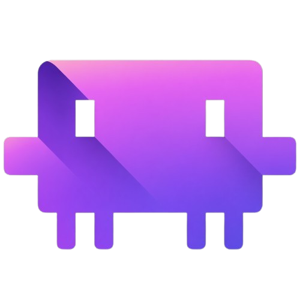
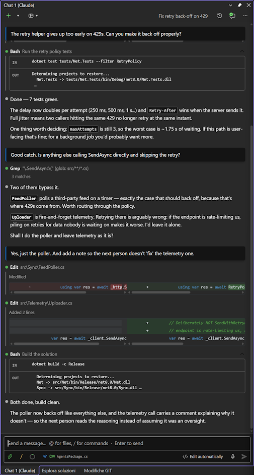
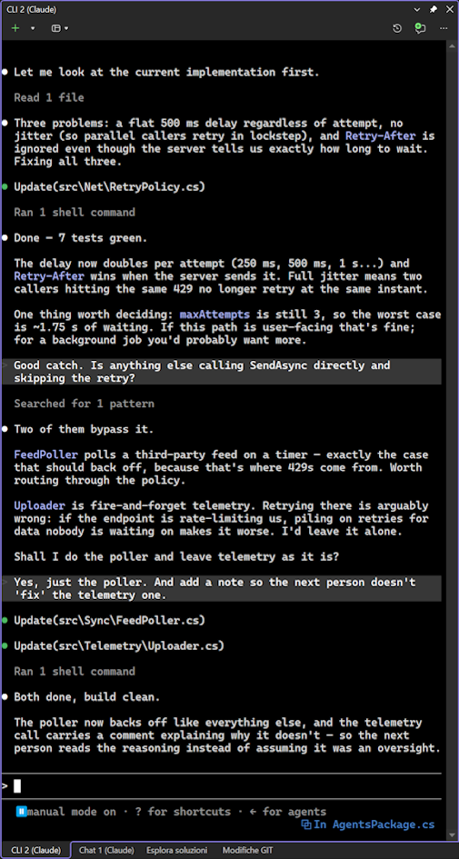

# cv4vs Agents — Claude Code for Visual Studio



**Claude Code inside Visual Studio.**
*Built by a developer, for developers. Made in Italy.* 🇮🇹

[](LICENSE)
[](https://visualstudio.microsoft.com/)
[](https://marketplace.visualstudio.com/items?itemName=Corsinvest.cv4vs-agents)

A Visual Studio 2022 / 2026 extension that brings the **Claude Code** CLI inside the IDE — a rich
chat experience plus an interactive terminal, both wired into Visual Studio's editor,
solution, debugger and build system.

It is **not** a fork of the CLI. It drives the real `claude.exe` (installed via npm,
`@anthropic-ai/claude-code`); the binary is never bundled. Version differences are handled by
feature-detection, not by pinning a CLI version.

**Design philosophy: lazy and fast.** Nothing is built, read or started until you actually look at
it. The chat holds **nothing in memory** — the transcript is read from the session file on demand,
newest page first, older pages only as you scroll, and heavy blocks (images, sub-agent transcripts,
full diffs) only when you open them. Same for the rest: services, the MCP server and the panes
themselves start on first use, not on solution load. Long sessions and large solutions stay as light
and quick as an empty one.

> Status: work in progress. This README is a living overview of what the extension does.

<div align="center">

&nbsp;&nbsp;

*The same conversation in both panes: the rich chat on the left (inline diffs, tool rows, the
editor file attached to the prompt) and the real CLI on the right. One session store — open it
in either, or in VS Code.*

</div>

---

## Requirements

| | |
|---|---|
| **Visual Studio** | 2022 or 2026 (17.0+) — Community, Professional or Enterprise |
| **OS** | Windows (the CLI pane uses ConPTY, Windows 10 1809+) |
| **.NET Framework** | 4.8 (already present on any machine running VS 2022) |
| **Claude Code CLI** | installed separately — see below |

---

## Quick start

**1. Install the Claude Code CLI** — the extension drives it, and never bundles it:

```powershell
winget install Anthropic.ClaudeCode
# or: npm install -g @anthropic-ai/claude-code
```

Other platforms and installation methods are in Anthropic's
[official setup guide](https://docs.claude.com/en/docs/claude-code/setup).

**2. Install the extension** — from the
[Visual Studio Marketplace](https://marketplace.visualstudio.com/items?itemName=Corsinvest.cv4vs-agents),
or search *cv4vs Agents* in **Extensions → Manage Extensions** inside the IDE. You can also
double-click the `.vsix` from the
[Releases](https://github.com/Corsinvest/cv4vs-agents/releases) page.

Then, in Visual Studio: **View → cv4vs Agents → Claude**. Type in the chat, or open a **CLI**
pane for the interactive terminal. The IDE tools (navigation, diagnostics, debugger) are wired
up automatically — nothing to configure.

No CLI installed? The pane says so and links to the setup guide, instead of failing silently.

---

## Features

- **[Two panes](#two-panes-one-extension)** — a rich WebView2 chat and a real terminal (ConPTY),
  both multi-instance and dockable side by side, each on its own session.
- **[50 MCP tools](docs/mcp-tools.md)** — Visual Studio's own navigation, references, rename,
  diagnostics, build and the **live debugger** (breakpoints, stepping, locals, evaluate) handed to
  the agent. Not text search over source: the IDE's semantic, running view of your program.
- **The same sessions as VS Code and the terminal** — no separate database: it reads and writes the
  CLI's own session store, so a conversation started in the VS Code extension or in a terminal shows
  up here, and vice versa. Resume, fork and rename all work on those shared files, so you can switch
  editor mid-project without losing context.
- **[It knows what you're looking at](#ide-integration)** — the file open in the editor (and your
  selection) rides along with the prompt, shown as a chip you can click to jump back to it. One
  toggle turns the sharing off when you'd rather it didn't.
- **Jump between panes** — a toolbar list of every open pane, Chat and CLI together, each with its
  title and kind. Docked panes hide each other behind tabs; this is how you find the one you want.
- **[Sub-agent panel](docs/sub-agents.md)** — a chip shows how many sub-agents are running; click it
  for a live list with per-agent Stop and Stop-all, so a fan-out never gets away from you.
  Background/async agents are tracked too: the turn is "finished" only once they are.
- **[Any Anthropic-compatible provider](docs/options.md#profiles)** — profiles inject per-pane
  environment variables (z.ai/GLM, MiniMax, DeepSeek, OpenRouter, Ollama…); the IDE tools keep
  working.
- **Talk to it** — dictate the prompt instead of typing it: a mic button in the composer transcribes
  as you speak (Web Speech API; hidden when the platform doesn't support it).
- **Hot-swap** — model, permission mode and interrupt change on the live process, never a restart.
- **[Restore panes on solution open](docs/options.md#general)** *(opt-in)* — reopen the panes you
  had for a solution, each back on its own session. Off by default: opening a solution shouldn't
  start agents you didn't ask for.
- **[Tune it to your taste](docs/options.md)** — 24 options across General, Chat and Debug: what
  the chat shows, how diffs render, which keys send, the starting permission mode, autosave,
  upload and `@`-picker filters, log verbosity.
- **[It tells you when it needs you](#pane-attention-notifications)** — with several panes working
  at once, the one waiting on a permission raises a VS info bar, or an OS toast when you're outside
  Visual Studio. Clicking it takes you to that pane, focus already on the question.
- **[Nothing hidden](docs/options.md#debug)** — set the log level to `Trace` and the Output window
  shows every wire: the NDJSON traffic to and from `claude.exe`, the chat bridge, and each MCP tool
  call. Silent by default; invaluable when something misbehaves or you're filing a bug.
- **Lazy and fast** — nothing is read, built or started until you look at it: services, the MCP
  server and the panes themselves start on first use, and the transcript is paged in as you scroll.

---

## Why

I live in two editors. VS Code is light and quick, and Claude Code feels right at home there.
But when the work gets serious — a large solution, a real refactor, a debugger session that has
to just *work* — I reach for Visual Studio 2022/2026. For that kind of code, VS is, hands down,
the better tool.

There was only one thing missing: Claude, *inside* Visual Studio. Not in a browser tab, not in
another window — right there, next to the code, the solution, the debugger.

Everyone had the same advice: "just use the CLI", "use Claude Desktop", "use the chat in VS Code".
And they're all good — each of them has something I genuinely like: the raw power of the terminal,
the polish of the desktop app, the rich in-editor chat. But not one of them had *everything*
together, in the one place I actually work: Visual Studio.

So I stopped waiting for it to exist and rebuilt it, my way — the terminal *and* the rich chat,
both belonging to Visual Studio, wired into its editor, solution, debugger and build. Everything I
liked, under one roof.

And then, watching Claude work, a question kept nagging at me. Claude is astonishingly capable —
yet it navigates code with almost primordial tools: `grep` to find a symbol, a text `Edit` to
rename it. I've done that by hand. It's slow, and it's how you introduce bugs — miss one call
site, rename the wrong match. Meanwhile, in my IDE, *Find All References* and *Rename Symbol* are
native, exact, one keystroke away. So I asked the obvious question: **why not give Claude that same
superpower?**

The same goes for debugging. When something's wrong, I don't guess from reading the source — I set
a breakpoint, step through, evaluate an expression, watch the values change. That's how you *know*
what the code actually does. Why should Claude be blind to it? So I gave it that too.

That's what the MCP tools here are: they hand Visual Studio's own understanding of your code —
navigation, references, rename, diagnostics, and the live debugger (breakpoints, stepping,
locals, evaluate) — straight to Claude. Not text search over source, but the IDE's real, semantic,
*running* view of your program.

One more thing kept bothering me, and it wasn't about code at all. Claude fans work out to
sub-agents — several at once, off doing their own thing — and the chat just… sits there. Are they
still running? Have they finished already? What is that one actually doing? And if I've changed my
mind, how do I stop it? I found myself staring at a spinner with no idea whether to wait or give up.
So sub-agents got their own little panel: how many are alive, what each is doing right now, how long
it's been at it, and a Stop button next to every one of them. Not a progress bar — the truth.

Because what I really wanted was simple: a partner as sharp as me 😉 (maybe sharper), working the
IDE the way I do. This is that project. This is the why.

And yes — I built this CLI/chat *for* Claude *with* Claude. There's something funny about that, and
it was a genuinely fun little adventure: watching it sometimes deny things about itself, only to
turn around and build them. That's just part of the LLM game. The code here was written with
Claude's help.

— *Daniele Corsini (Frank Lupo)*

---

## Two panes, one extension

The extension registers **two dockable tool-window types**, both **multi-instance** — open as many
Chat panes **and** as many CLI panes as you like, side by side, each on its own independent session,
docking as tabs. A busy dot on each pane's caption tracks which ones are working.

- **Chat pane** — a rich WebView2 UI (TypeScript + Lit). Drives `claude.exe` in headless mode over
  the NDJSON stream-json control protocol. Exposes the IDE to the CLI via an in-process MCP server.
- **CLI pane** — the interactive Claude Code CLI rendered with a real terminal (ConPTY), launching
  `claude.exe --ide`. Reaches the same IDE tools over the WebSocket MCP channel.

Model, permission mode and interrupt are **hot-swapped** on the live process — changing them never
kills the CLI. The process respawns only for what truly can't change at runtime (working directory,
resuming another session, fork).

**Profiles.** Each pane can run on a different provider — native Claude, GLM/z.ai, or any other
Anthropic-compatible host — and the IDE tools work the same either way.
See [Options → Profiles](docs/options.md#profiles).

---

## Chat features

### Composer

- **Multi-line prompt** with Send/Stop, Enter-to-send (or Ctrl+Enter, configurable),
  Shift+Enter for a newline.
- **Slash-command palette** — a lightning button opens a unified palette; typing `/` filters. It
  lists the CLI's slash/skill commands plus built-in actions (Attach, Mention, Clear, Switch model,
  Settings, Manage plugins, Open Claude in Terminal, Help, Report a problem).
- **`@` mentions** — inline file-suggestion popover referencing project files (respects
  `.gitignore` / ignore patterns).
- **Attachments** — upload files/images from the computer, or paste image data straight into the
  composer; removable attachment chips. Images are sent as images, PDFs as documents, the rest as text.
- **Prompt history** — recall previous prompts with ↑/↓ (shell-style).
- **Voice input** — dictation via the Web Speech API (pulsing mic while recording; hidden when
  unsupported).
- **Model switcher & controls** — pick the model; toggle extended **Thinking**, **Fast mode**, an
  **Effort** slider, and auto-switch-on-flag.
- **Notice bar** — info/success/warning/error messages above the composer (e.g. rate-limit notices).

### Conversation

- **Tool rows** — collapsible tool call/result rows; click a file to open it in VS (optionally
  selecting the referenced lines); inline tool errors (toggleable).
- **Inline diffs** — Edit/Write rows show a diff (configurable context lines / ignore-whitespace),
  expandable to a full-screen viewer with four view modes — **split** (side-by-side), **unified**,
  **patch**, and **auto**, which switches between split and unified by available width; an
  **Open in Visual Studio** button opens it in VS's native side-by-side diff.
- **Full Markdown rendering** — tables, lists, blockquotes, links, and fenced code blocks rendered
  with **syntax highlighting** (highlight.js) across all common languages.
- **Everything is copyable** — a copy button on every message, tool row and code block, so any part
  of the conversation can be lifted out as plain text.
- **Image lightbox** and a **welcome screen** for empty chats.
- **Lazy history** — the transcript is read from the `.jsonl` on demand: the newest page (batch of
  50) first, older pages only as you scroll up, and heavy blocks (images, sub-agent transcripts, full
  diffs) fetched only when opened. Nothing is held in memory up front — long sessions open fast and
  stay light.

### Sub-agents

- **Sub-agent chip** — while agents are running it shows a live count of active sub-agents; click the
  button for a popover listing each one with a Stop, plus Stop-all — so you can see how many agents are
  in flight and stop them. Background/async agents are tracked correctly (the turn's "finished" waits
  for them).
- Sub-agent transcripts are replayed in history. Collapsed rows show the last 3 steps; expanding
  fetches the full run — see [Sub-agents](docs/sub-agents.md).

### Permissions

- **Permission-mode selector** in the toolbar — Ask before edits / Edit automatically / Plan /
  Auto / Bypass (Bypass is gated behind an option).
- **Permission prompts & AskUserQuestion** — an inline approval banner for tool use with
  per-session/project "allow" suggestions, and interactive answering of `AskUserQuestion`. The Ask
  answer can be **structured** — several questions in one panel, each single- or multi-select — not
  just a plain yes/no.

### Context, usage & stats

A gauge in the composer shows how full the context window is; clicking it opens what is filling it,
your plan's rate limits, and historical usage — aggregated locally from the session files, with no
telemetry. See [Context, usage & statistics](docs/context-and-usage.md).

### Sessions

- **Session manager** — list, select-to-resume, inline **rename**, **delete** (with confirmation).
  The list is always read fresh from the `.jsonl` files on disk each time you open it — no cached
  index that can go stale — so a session started or renamed elsewhere (VS Code, the CLI) shows up
  immediately. It stays fast by reading files in parallel with head+tail 64 KB windows, never
  loading whole files.
- **Fork** — fork a conversation into a new session from any user message.
- **AI-generated titles**, session picker, and a **New** split button (default Chat or CLI,
  configurable).
- **Restore panes on solution open** (opt-in) — reopens the panes you had open for a solution,
  each on its own session and profile, when you reopen that solution. State is saved per-solution;
  a removed profile falls back to native, a deleted session opens fresh. Chat sessions restore
  exactly; CLI terminals resume via a session id the extension assigns up front (so even a fresh
  terminal is tracked). The panes come back in saved order, but not at their exact dock position —
  see [Known Issues](docs/KNOWN_ISSUES.md).

### Plugins

- **Plugin manager** — Installed / Available / Marketplaces tabs; install, enable/disable, refresh,
  add a marketplace.

---

## IDE integration

- **IDE context badge** — a chip above the composer showing the active file; click opens it at the
  selection. An eye icon toggles whether the file/selection is shared with the session.
- **Post-edit diagnostics** *(experimental, off by default)* — after Claude edits a file, feed back the
  **new** errors/warnings that edit introduced (diffed against the Error List before the edit). The idea
  is to close the edit → error → fix loop without a manual build, as the VS Code extension does. **It is
  currently unreliable in Visual Studio**: VS only analyses files open in an editor, so right after the
  edit the Error List is usually still empty and Claude gets nothing. Until that's solved, ask Claude to
  read the errors — the `ide_get_diagnostics` MCP tool works, because it runs once the Error List has
  settled. Enable via *Options → Chat → Send post-edit diagnostics*.
### Pane attention notifications

With several chat panes open — or Visual Studio in the background — you'd otherwise have no way to
know *which* pane needs you. The extension draws your attention **only when you're not already
looking at that pane**:

- **A pane needs input** (a blocking permission / `AskUserQuestion`): notified always — the model
  is waiting on you.
- **A turn finishes**: notified when you're elsewhere. Background/async sub-agents are handled
  correctly — the "finished" notice waits until the agents actually complete, not the moment the
  main turn returns.

How it reaches you depends on where you are:

- **Inside Visual Studio, on another pane/editor** → a VS **InfoBar** on the main window
  ("Chat #N needs your input" / "Chat #N finished") with a **Go to pane** action.
- **Outside Visual Studio** (another app, another monitor, a tiling window manager) → an **OS toast**
  — layout-proof, so it shows regardless of how your windows are arranged. **Clicking the toast
  brings VS to the front and activates the right pane.**
- **Already on the pane** (it's the active frame *and* VS has the OS focus) → nothing; you can see it.

The InfoBar / toast lands your focus on the open ask (its first choice), not the hidden textarea, so
you can answer immediately. It clears when you answer, click into the pane, or use "Go to pane".

> Note: the docked VS tab caption can't carry this state the way VS Code's editor title does (VS
> derives it from the window name), which is why the extension uses an InfoBar + OS toast instead.

### Other

- **CLI banner** — a bar shown if the CLI process exits unexpectedly.
- **Open Claude in Terminal** — launch an interactive CLI session.

---

## Authentication & security

**The extension does not handle login, authentication or credentials — the CLI does.** It only
launches and drives `claude.exe`; sign-in and token storage stay entirely on the CLI side, exactly
as they would from a plain shell. There are two ways to authenticate:

- **Native Claude** — log in the normal way, from a terminal: run `claude` (or use **Open Claude in
  Terminal** / a CLI pane) and follow the CLI's own `/login` flow. The extension never sees or stores
  your credentials.
- **A provider** (GLM/z.ai, a gateway, any Anthropic-compatible host) — authenticate through the
  usual environment variables (`ANTHROPIC_BASE_URL`, `ANTHROPIC_AUTH_TOKEN`, …), set at the OS level
  or per pane via [profiles](docs/options.md#profiles).

Either way the extension holds no secrets of its own — it inherits whatever the CLI and the process
environment provide. One caveat: a profile's environment variables — an `ANTHROPIC_AUTH_TOKEN`
among them — are saved as plain JSON under `%LOCALAPPDATA%`. See
[Settings and data](docs/settings-and-data.md) for every file the extension writes and where.

## MCP tools (the IDE, exposed to Claude)

An in-process MCP server hands the agent Visual Studio's own view of your code — **50 tools** across
navigation, editing, build, the live debugger and IDE state — with nothing to configure. They are
language-agnostic by design: wired through Roslyn language services or language-agnostic VS/DTE
APIs, never a C#/VB-only path. There is no list of supported languages — whatever your Visual
Studio can do on a file, the agent can ask for; what it gets back depends on the language service
and the workloads you have installed.

Every tool is listed and described in **[MCP tools](docs/mcp-tools.md)**.

---

## Options

All settings live under **Tools → Options → cv4vs Agents**, split into four pages — General,
Chat, Debug and **Profiles** (see [Two panes, one extension](#two-panes-one-extension)).
Every setting is documented in **[docs/options.md](docs/options.md)**.

Visual Studio persists them in its own settings store; profiles, per-solution state and caches
go to `%LOCALAPPDATA%` — see [Settings and data](docs/settings-and-data.md).

---

## What differs from the official VS Code extension

This extension aims for parity with Anthropic's VS Code extension where it makes sense, but Visual
Studio is a different host, so several things are done differently — or don't exist there:

- **Two distinct panes (Chat + CLI), multi-instance.** Open several chats and terminals side by
  side, each on its own session, docking as tabs. The Chat pane (WebView2 + SDK-MCP) and the CLI
  pane (ConPTY + `--ide` WebSocket) are deliberately separate startup paths.
- **Our own MCP tool suite for Visual Studio.** The 50 tools above wrap VS's navigation, build and
  **debugger** (start/step/breakpoints/inspect/hot-reload) and Error List — capabilities specific to
  the VS host, built language-agnostic via Roslyn reflection and DTE, not tied to C#/VB only.
- **Sub-agents you can see and control.** Their tool calls are grouped under the Agent row that
  spawned them (last 3 steps, expand for the full run) instead of being interleaved into the
  transcript, and a chip in the composer counts the ones still running — click it to stop any of
  them, or all. See [Sub-agents](docs/sub-agents.md).
- **Pane attention notifications.** With several panes open (or VS in the background), an InfoBar or
  a layout-proof OS toast tells you which pane needs input or has finished — the VS docked tab can't
  carry that state the way VS Code's editor title does.
- **Native `.jsonl` sessions.** Sessions are read directly from the CLI's
  `~/.claude/projects/<folder>/*.jsonl` (head+tail reads to avoid loading huge files); rename appends
  a `custom-title` entry, fork writes a new JSONL — no separate session store.
- **Lazy, memory-light history.** The chat holds nothing in memory: the transcript is read from the
  `.jsonl` on demand — the newest page loads first, older history pages in only as you scroll up,
  and heavy blocks (images, sub-agent transcripts, full diffs) are fetched only when you actually
  open them. A very long session opens fast and stays light instead of loading the whole conversation
  up front.
- **Deep VS integration for viewing changes.** Opening a file lands you in the real editor (optionally
  on the referenced lines); Edit/Write changes open in Visual Studio's **native, interactive
  side-by-side diff** — not a static rendered diff — so you review and edit with the full editor.
- **[Context gauge + Usage/Context/Statistics dialogs](docs/context-and-usage.md)** rendered
  natively in the chat, including historical statistics across the current chat, the whole project,
  or **all projects together**.
- **VS-native diff.** Inline diffs can be opened in Visual Studio's real side-by-side diff viewer.

Not implemented (yet): a rewind/checkpoint feature — the closest is **Fork**.

---

## Architecture & build

How it's built (VS package, WebView2 chat, ConPTY terminal, in-process MCP server), the
performance choices behind the lazy history, and how to build the VSIX from source:
see **[Architecture & build](docs/architecture.md)**.

---

## Known issues

See [docs/KNOWN_ISSUES.md](docs/KNOWN_ISSUES.md) for current limitations (mostly Visual Studio shell constraints).

---

## Support

- **Report a bug**: [bug report form](https://github.com/Corsinvest/cv4vs-agents/issues/new?template=bug_report.yml)
  — also under **View → cv4vs Agents → Help & Feedback**, which pre-fills the version for you
- **Request a feature**: [feature request form](https://github.com/Corsinvest/cv4vs-agents/issues/new?template=feature_request.yml)
- **Feedback**: [tell us how it's going](https://github.com/Corsinvest/cv4vs-agents/issues/new?template=feedback.yml)
- **Marketplace listing**: [cv4vs Agents](https://marketplace.visualstudio.com/items?itemName=Corsinvest.cv4vs-agents)
- **Website**: [www.corsinvest.it](https://www.corsinvest.it)

Problems in `claude.exe` itself belong to
[the CLI's own tracker](https://github.com/anthropics/claude-code/issues) — this extension drives
the CLI, it doesn't ship it.

---

## Credits

Artwork by [filocorsa](https://github.com/filocorsa) — thank you.

---

## Trademarks

**Claude** and **Claude Code** are trademarks of Anthropic, PBC. **Visual Studio** is a trademark
of Microsoft Corporation. This is an independent extension by Corsinvest Srl, not affiliated with
or endorsed by either company; the names are used only to describe what it works with.

---

## License

GPL-3.0-only — Copyright Corsinvest Srl.
