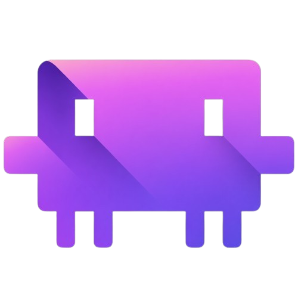
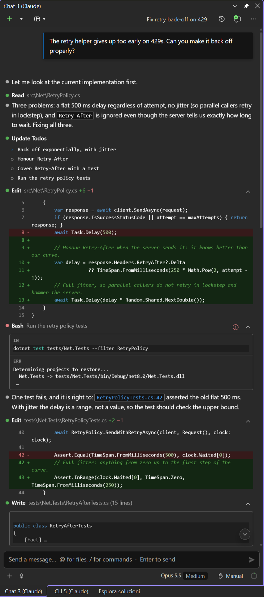
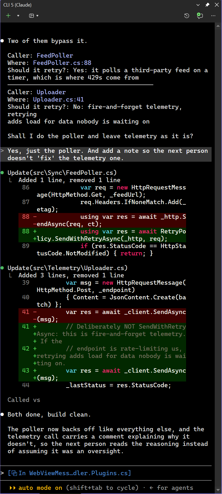

# cv4vs Agents: Claude Code for Visual Studio



**Claude Code inside Visual Studio.**
*Built by a developer, for developers. Made in Italy.* 🇮🇹

[](LICENSE)
[](https://visualstudio.microsoft.com/)
[](https://marketplace.visualstudio.com/items?itemName=Corsinvest.cv4vs-agents)
[](https://marketplace.visualstudio.com/items?itemName=Corsinvest.cv4vs-agents)
[](https://corsinvest.github.io/cv4vs-agents/diary/)

A Visual Studio 2022 / 2026 extension that brings the **Claude Code** CLI inside the IDE: a rich
chat experience plus an interactive terminal, both wired into Visual Studio's editor,
solution, debugger and build system.

It is **not** a fork of the CLI. It drives the real `claude.exe` (installed via npm,
`@anthropic-ai/claude-code`); the binary is never bundled. Version differences are handled by
feature-detection, not by pinning a CLI version.

**Design philosophy: lazy and fast.** Nothing is built, read or started until you actually look at
it. The chat holds **nothing in memory**: the transcript is read from the session file on demand,
newest page first, older pages only as you scroll, and heavy blocks (images, sub-agent transcripts,
full diffs) only when you open them. Same for the rest: services, the MCP server and the panes
themselves start on first use, not on solution load. Long sessions and large solutions stay as light
and quick as an empty one.

**Documentation: [corsinvest.github.io/cv4vs-agents](https://corsinvest.github.io/cv4vs-agents/)**. Why it exists, in the author's
words: [Why](https://corsinvest.github.io/cv4vs-agents/why/).

<div align="center">

&nbsp;&nbsp;

*The same conversation in both panes: the rich chat on the left (inline diffs, tool rows, the
editor file attached to the prompt) and the real CLI on the right. One session store: open it
in either, or in VS Code.*

</div>

---

## Requirements

| | |
|---|---|
| **Visual Studio** | 2022 or 2026 (17.0 or later), Community, Professional or Enterprise, x64 |
| **Claude Code CLI** | installed separately; see below |

---

## Quick start

**1. Install the Claude Code CLI**: the extension drives it, and never bundles it:

```powershell
winget install Anthropic.ClaudeCode
# or: npm install -g @anthropic-ai/claude-code
```

Other platforms and installation methods are in Anthropic's
[official setup guide](https://code.claude.com/docs/en/setup).

**2. Install the extension**: from the
[Visual Studio Marketplace](https://marketplace.visualstudio.com/items?itemName=Corsinvest.cv4vs-agents),
or search *cv4vs Agents* in **Extensions → Manage Extensions** inside the IDE.

Then, in Visual Studio: **View → cv4vs Agents → Claude**. Type in the chat, or open a **CLI**
pane for the interactive terminal. The IDE tools (navigation, diagnostics, debugger) are wired
up automatically: nothing to configure.

No CLI installed? The pane says so and links to the setup guide, instead of failing silently.

### Preview builds

Release candidates are tagged `vX.Y.Z-rcN` and published on the
[Releases](https://github.com/Corsinvest/cv4vs-agents/releases) page with the `.vsix` attached;
they are not on the Marketplace, which takes neither a suffixed version nor a second upload of one
already published. Double-click the file to install.

Two things to know before trying one. They receive **no automatic updates**: a `.vsix` installed by
hand has no gallery behind it to check. And every preview of a release carries the **same version
number**: the `-rcN` suffix lives on the tag, because a VSIX manifest version is digits only, so
installing `rc2` over `rc1` is refused as *already installed*. Uninstall the previous preview first,
from **Extensions → Manage Extensions**.

Stable releases carry no `.vsix`: install them from the Marketplace, where updates arrive on their
own.

---

## Features

Each line links to the page that explains it.

- **[Two panes](https://corsinvest.github.io/cv4vs-agents/two-panes/)**: a rich WebView2 chat and a real terminal (ConPTY), both
  multi-instance and dockable side by side, each on its own session.
- **[80 MCP tools](https://corsinvest.github.io/cv4vs-agents/mcp-tools/)**: Visual Studio's own navigation, references, rename,
  diagnostics, build, its Test Explorer and the live debugger handed to the agent.
- **[It offers when you break](https://corsinvest.github.io/cv4vs-agents/guides/debug-with-the-agent/)**: stop on an exception and one
  press asks about it; the agent reads the live stack and locals rather than guessing.
- **[Review changes in VS's own diff](https://corsinvest.github.io/cv4vs-agents/chat/diff/)**: every Edit shows as an inline
  diff and opens in Visual Studio's native side-by-side one.
- **[Edit the plan before you approve it](https://corsinvest.github.io/cv4vs-agents/chat/permissions/#reviewing-a-plan)**: open it in the
  Markdown editor, change it, and approving sends what you wrote.
- **[Take the files back](https://corsinvest.github.io/cv4vs-agents/chat/rewind/)**: `/rewind` restores them to the state before any
  message of the session, and leaves the conversation where it is.
- **[Clickable file references](https://corsinvest.github.io/cv4vs-agents/chat/file-links/)**: `ClientEvents.cs:208` in an answer, in
  plain prose, is a link that opens the file there; a range selects those lines.
- **[Know when the next message costs more](https://corsinvest.github.io/cv4vs-agents/chat/context-and-usage/#the-prompt-cache)**: the
  context gauge tracks the prompt cache and warns before it expires.
- **[Keep writing while it answers](https://corsinvest.github.io/cv4vs-agents/chat/queued-messages/)**: the next message waits for the
  turn to end; read, fix, drop or join what is queued.
- **[The same sessions as VS Code and the terminal](https://corsinvest.github.io/cv4vs-agents/chat/sessions/)**: it reads and writes the
  CLI's own session store, no separate database.
- **[Remote Control](https://corsinvest.github.io/cv4vs-agents/claude/remote-control/)**: hand a running session to `claude.ai/code` or
  the Claude mobile app, with a QR code to scan.
- **[It knows what you're looking at](https://corsinvest.github.io/cv4vs-agents/ide-integration/)**: the open file and your selection
  ride along with the prompt, and one toggle turns that off.
- **[Ask from the editor](https://corsinvest.github.io/cv4vs-agents/guides/ask-from-the-editor/)**: right-click code, the Error List or
  the Output window; the prompts are yours to edit.
- **[Several panes at once](https://corsinvest.github.io/cv4vs-agents/guides/several-panes/)**: a list of every open pane, and an InfoBar
  or OS toast when one needs you.
- **[Sub-agent panel](https://corsinvest.github.io/cv4vs-agents/chat/sub-agents/)**: how many are running, what each is doing, and a Stop
  beside every one.
- **[Any Anthropic-compatible provider](https://corsinvest.github.io/cv4vs-agents/guides/another-provider/)**: profiles inject per-pane
  environment variables (z.ai/GLM, MiniMax, DeepSeek, OpenRouter, Ollama…).
- **[Plan usage in the status bar](https://corsinvest.github.io/cv4vs-agents/documents/usage/#status-bar)**: `Claude: 5h 44% · 7d 10%`
  beside the notification bell.
- **Analytics tabs**, all reading the local session files with no telemetry:
  [Statistics](https://corsinvest.github.io/cv4vs-agents/documents/statistics/), [Usage](https://corsinvest.github.io/cv4vs-agents/documents/usage/),
  [Context usage](https://corsinvest.github.io/cv4vs-agents/documents/context-usage/), [File history](https://corsinvest.github.io/cv4vs-agents/documents/file-history/).
- **[Plugin manager](https://corsinvest.github.io/cv4vs-agents/claude/plugins/)**: install, enable, disable and update plugins without
  leaving the chat.
- **[Voice in, voice out](https://corsinvest.github.io/cv4vs-agents/chat/composer/#voice-input)**: dictate the prompt, and have an
  [answer read aloud](https://corsinvest.github.io/cv4vs-agents/chat/conversation/#read-a-response-aloud).
- **[Update Claude Code from Visual Studio](https://corsinvest.github.io/cv4vs-agents/claude/updating/)**: from the chat notice or the
  menu; sessions already open keep working.
- **[Spend less context](https://corsinvest.github.io/cv4vs-agents/guides/spending-less-context/)**: which settings reach the wire, and
  which only change what the chat draws.
- **[Tune it to your taste](https://corsinvest.github.io/cv4vs-agents/options/)**: every option, with its default.
- **[Nothing hidden](https://corsinvest.github.io/cv4vs-agents/troubleshooting/#turn-on-the-log)**: set the log level to `Trace` and the
  Output window shows every wire.

---

## Documentation

Everything is at **[corsinvest.github.io/cv4vs-agents](https://corsinvest.github.io/cv4vs-agents/)**:

| | |
|---|---|
| Start here | [Getting started](https://corsinvest.github.io/cv4vs-agents/getting-started/), [Two panes](https://corsinvest.github.io/cv4vs-agents/two-panes/), [Known issues](https://corsinvest.github.io/cv4vs-agents/known-issues/) |
| Guides | [Debug with the agent](https://corsinvest.github.io/cv4vs-agents/guides/debug-with-the-agent/), [Teach the agent about the IDE](https://corsinvest.github.io/cv4vs-agents/guides/teach-the-agent/), [Another provider](https://corsinvest.github.io/cv4vs-agents/guides/another-provider/) |
| Chat | [The composer](https://corsinvest.github.io/cv4vs-agents/chat/composer/), [The conversation](https://corsinvest.github.io/cv4vs-agents/chat/conversation/), [Permissions](https://corsinvest.github.io/cv4vs-agents/chat/permissions/), [Sessions](https://corsinvest.github.io/cv4vs-agents/chat/sessions/) |
| Claude Code | [Authentication and security](https://corsinvest.github.io/cv4vs-agents/claude/authentication/), [Compared with the VS Code extension](https://corsinvest.github.io/cv4vs-agents/claude/vs-code-differences/) |
| Reference | [Options](https://corsinvest.github.io/cv4vs-agents/options/), [Settings and data](https://corsinvest.github.io/cv4vs-agents/settings-and-data/), [Troubleshooting](https://corsinvest.github.io/cv4vs-agents/troubleshooting/), [Architecture & build](https://corsinvest.github.io/cv4vs-agents/architecture/) |

The pages are the Markdown files under [`docs/src/content/docs`](docs/src/content/docs).

---

## Support

- **Report a bug**: [bug report form](https://github.com/Corsinvest/cv4vs-agents/issues/new?template=bug_report.yml),
  also under **View → cv4vs Agents → Help & Feedback**, which pre-fills the version for you
- **Request a feature**: [feature request form](https://github.com/Corsinvest/cv4vs-agents/issues/new?template=feature_request.yml)
- **Feedback**: [tell us how it's going](https://github.com/Corsinvest/cv4vs-agents/issues/new?template=feedback.yml)
- **Marketplace listing**: [cv4vs Agents](https://marketplace.visualstudio.com/items?itemName=Corsinvest.cv4vs-agents)
- **Website**: [www.corsinvest.it](https://www.corsinvest.it)

Taking part here means following our [Code of Conduct](CODE_OF_CONDUCT.md).

Problems in `claude.exe` itself belong to
[the CLI's own tracker](https://github.com/anthropics/claude-code/issues); this extension drives
the CLI, it doesn't ship it.

---

## Credits

Artwork by [filocorsa](https://github.com/filocorsa), thank you.

---

## Trademarks

**Claude** and **Claude Code** are trademarks of Anthropic, PBC. **Visual Studio** is a trademark
of Microsoft Corporation. This is an independent extension by Corsinvest Srl, not affiliated with
or endorsed by either company; the names are used only to describe what it works with.

---

## License

GPL-3.0-only, Copyright Corsinvest Srl.
