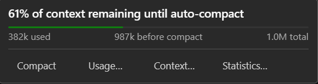
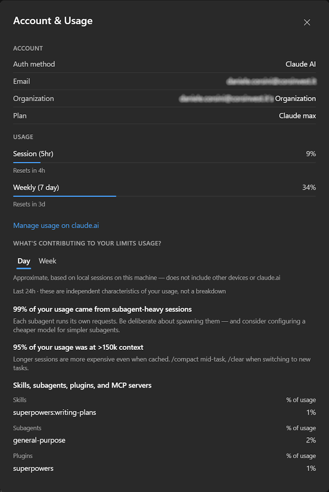
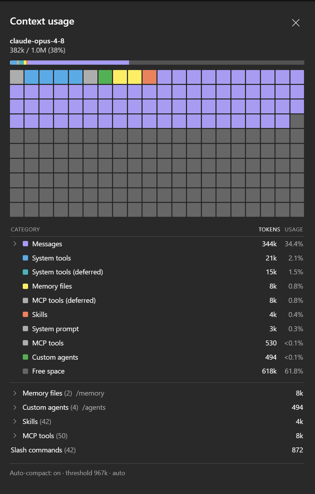
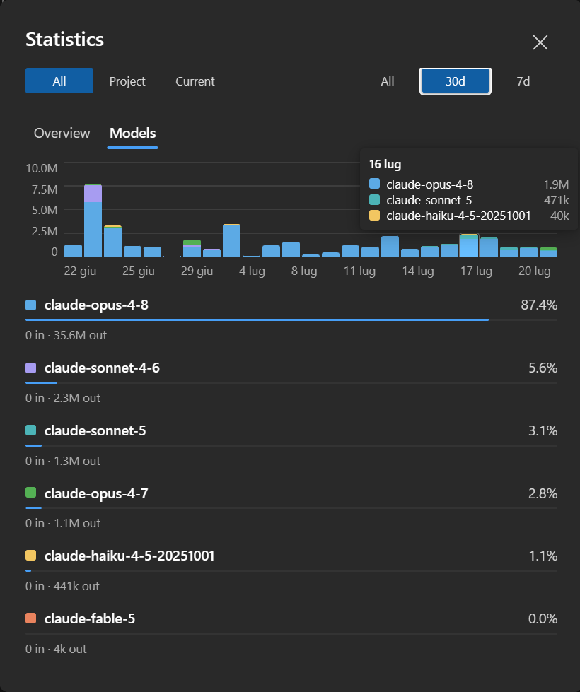

# Context, usage & statistics

Four related views, reachable from the **context gauge** in the composer toolbar: how full the
current context window is, what is filling it, what your plan allows, and what you have spent
over time.

---

## The gauge

A circular token-usage gauge sits in the composer, filling as the conversation grows — green,
then orange, then red as it approaches the auto-compact threshold.

Clicking it opens a small panel: a progress bar, the numbers, and shortcuts to the three dialogs
below.

`61% of context remaining until auto-compact` is the number that matters day to day: not how much
you have used, but how much room is left before the CLI compacts the conversation.

---

## Account & usage

Account information and the plan's rate-limit windows — what you are allowed, and how much of it
is left in the current window. Read live from the CLI, not computed here.

---

## Context usage

What is actually filling the context window right now.

The grid at the top is a memory map — one cell per slice of the window, coloured by category — so
the shape of the problem is visible at a glance: a wall of purple means the conversation itself is
the weight; a band of blue means tool definitions are.

Below, the same data as a table: messages, system tools, memory files, skills, MCP tools, custom
agents, system prompt, and free space, each with tokens and percentage. The expandable rows at the
bottom list what is loaded — which memory files, which agents, which skills, which MCP tools.

The footer shows whether auto-compact is on and at what threshold.

---

## Statistics

Historical usage, aggregated **locally** from the CLI's own session files.

Two tabs — **Overview** and **Models** — and two selectors that decide what is counted:

| Scope | Counts |
|---|---|
| **Current** | this chat only |
| **Project** | every chat in this project |
| **All** | every chat, across every project |

| Range | Period |
|---|---|
| **All** | everything on disk |
| **30d** / **7d** | the last 30 or 7 days |

The chart stacks tokens per day by model; hovering a bar breaks that day down. Below, each model
with its share, and input/output tokens.

Model names are shown **exactly as the API returned them** (`claude-opus-4-8`, not "Opus 4.8"), so
a third-party provider's model ids stay readable instead of being mapped onto Claude names.

### How it works

There is no telemetry and nothing is uploaded. The numbers come from the `.jsonl` transcripts the
CLI already writes on your machine — the same files the chat history is read from.

Reading every file on every open would be slow (hundreds of files, hundreds of MB), so the results
are cached per file in `stats-cache.json`, keyed by the file's modification time and size. A file
that hasn't changed is never parsed again; a session you just used is re-read because its mtime
moved. The first run indexes everything and shows progress, later runs are near-instant.

Because the source is the shared session store, statistics cover conversations started **anywhere**
— this extension, the VS Code extension, or the terminal.
