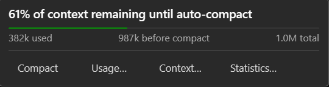
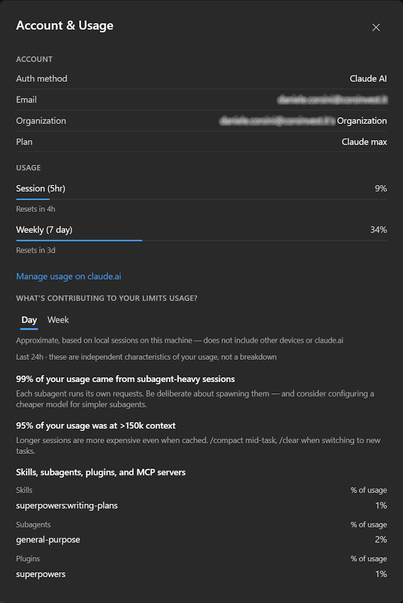
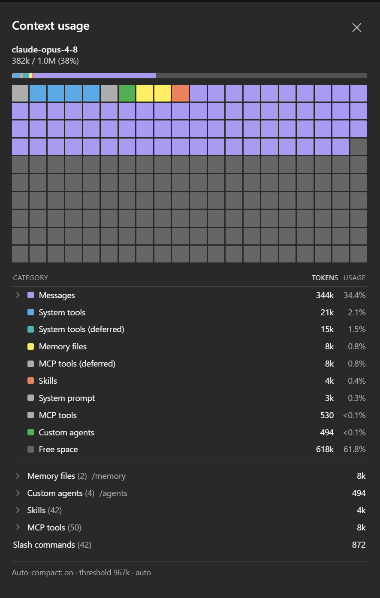
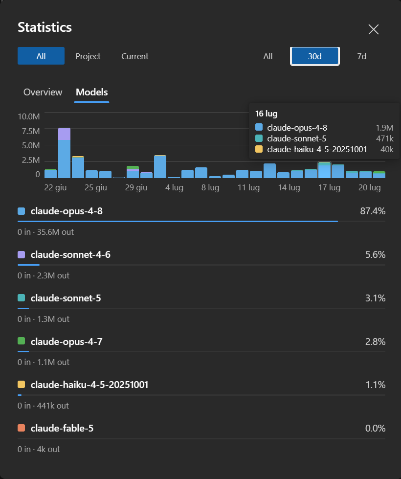

# Context, usage & statistics

Four related views, reachable from the **context gauge** in the composer toolbar: how full the
current context window is, what is filling it, what your plan allows, and what you have spent
over time.

---

## The gauge

A circular token-usage gauge sits in the composer, filling as the conversation grows — green,
then orange, then red as it approaches the auto-compact threshold.

Clicking it opens a small panel: a progress bar, the numbers, and shortcuts to the three dialogs
below.

`61% of context remaining until auto-compact` is the number that matters day to day: not how much
you have used, but how much room is left before the CLI compacts the conversation.

---

## Account & usage

Account information and the plan's rate-limit windows — what you are allowed, and how much of it
is left in the current window. Read live from the CLI, not computed here.

---

## Context usage

What is actually filling the context window right now.

The grid at the top is a memory map — one cell per slice of the window, coloured by category — so
the shape of the problem is visible at a glance: a wall of purple means the conversation itself is
the weight; a band of blue means tool definitions are.

Below, the same data as a table: messages, system tools, memory files, skills, MCP tools, custom
agents, system prompt, and free space, each with tokens and percentage. The expandable rows at the
bottom list what is loaded — which memory files, which agents, which skills, which MCP tools.

The footer shows whether auto-compact is on and at what threshold.

---

## Statistics

Historical usage, aggregated **locally** from the CLI's own session files.

Two tabs — **Overview** and **Models** — and two selectors that decide what is counted:

| Scope | Counts |
|---|---|
| **Current** | this chat only |
| **Project** | every chat in this project |
| **All** | every chat, across every project |

| Range | Period |
|---|---|
| **All** | everything on disk |
| **30d** / **7d** | the last 30 or 7 days |

The chart stacks tokens per day by model; hovering a bar breaks that day down. Below, each model
with its share, and input/output tokens.

Model names are shown **exactly as the API returned them** (`claude-opus-4-8`, not "Opus 4.8"), so
a third-party provider's model ids stay readable instead of being mapped onto Claude names.

### How it works

There is no telemetry and nothing is uploaded. The numbers come from the `.jsonl` transcripts the
CLI already writes on your machine — the same files the chat history is read from.

Reading every file on every open would be slow (hundreds of files, hundreds of MB), so the results
are cached per file in `stats-cache.json`, keyed by the file's modification time and size. A file
that hasn't changed is never parsed again; a session you just used is re-read because its mtime
moved. The first run indexes everything and shows progress, later runs are near-instant.

Because the source is the shared session store, statistics cover conversations started **anywhere**
— this extension, the VS Code extension, or the terminal.

---

## Spending less context

The gauge tells you the window is filling; this is what you can actually do about it.

Worth saying first, because most of the Chat options page looks like it belongs here and does not:
**a setting that changes what the chat draws changes nothing about what was sent.** By the time the
tool result is on screen, it has already been through the model. Preview lines, Compact Ask answers,
Show tool errors inline, the diff options — every one of those is a rendering choice. The knobs
below are the ones that reach the wire.

### What travels with every message

Each message carries a short block naming the file you have open and, if you have selected code,
which lines — so Claude knows what "this method" means without you pasting it.

That block is a couple of dozen tokens, and *Options → Chat → Send the selected text with the
message* decides whether the code goes with it:

| | What the block says | Cost |
|---|---|---|
| **Off** *(default)* | `lines 40 to 78 from Foo.cs` | ~30 tokens, every message |
| **On** | the same, plus the selected code | ~30 tokens **plus the selection**, every message |

Off, Claude opens the file when it needs the code — once, on its own initiative, and free to read
around the selection. On, the code is there immediately but goes out again with **every** message
sent while that selection stands, including "yes", "go on" and "no, the other one".

Turn it on when you routinely ask about code you have not saved: on disk the file is stale, and
Claude reading it would see the wrong thing. Otherwise leave it off.

#### The chip tells you which one is going out

A setting in a dialog you opened once is easy to forget, so the context chip carries the answer. The
icon at its right end names the shape of the block:

| Icon | Going out | When |
|---|---|---|
| 🔖 bookmark | the position — file and line numbers | the setting is off, **or** there is no selection |
| 🧾 code block | the position **and** the selected code | the setting is on **and** you have a selection |

The second row needs both conditions: an open file with nothing selected has no code to attach, so
it stays a bookmark whatever the setting says. The icon follows what actually goes out, not how the
option is configured — and it disappears entirely when the eye is shut, since then nothing does.

The tooltip spells the same thing out in words, so the icon never has to be guessed at.

> **This does not stop the CLI from seeing your selection.** Visual Studio also pushes editor
> selections — the code included — over the IDE integration channel, the same way the VS Code
> extension does, and that path does not consult this setting. What the setting controls is the
> block prepended to *your message*, which is what accumulates in the conversation turn after turn.
> That accumulation is the cost worth managing; the live selection is re-sent, not stacked.

### The eye: sending nothing at all

Clicking the chip stops the block entirely — no file, no lines — for **that pane only**, until you
click it again. It then dims and picks up a struck-through eye; sharing is the ordinary state, so
only the exception is marked.

Worth doing when the conversation has nothing to do with what is on screen: a design discussion, a
question about another repo, a long back-and-forth about something abstract. This is the bigger of
the two knobs — the setting above changes what the block *contains*, the eye decides whether there
is one at all.

Picking an [editor prompt](../options.md#editor-prompts) re-opens it: a question about "this code"
with nothing saying which code would reach the CLI as a question about nothing.

### Thinking and effort

The model menu in the composer toolbar carries the extended-thinking toggle and the effort level.
Thinking buys the model room to reason before answering — real output tokens, on every turn it uses
them. It earns its cost on a hard debugging session and wastes it on "rename this variable".

These are per-session and live in the toolbar, not in Options, because they are the ones worth
changing *during* a conversation rather than once and for all.

### Post-edit diagnostics

*Options → Chat → Send post-edit diagnostics* (off by default) feeds the new errors an edit
introduced back to Claude after every edit. That is extra content into the context on each one.
It is [experimental and unreliable in Visual Studio](../../README.md#ide-integration) for reasons
that have nothing to do with tokens — but if you did turn it on, this is part of what it costs.

### What does not help

- **Autosave before Claude reads/writes** — turning it *off* costs more, not less: Claude reads the
  stale file, then has to ask for the editor buffer separately.
- **Respect `.gitignore` / Ignored patterns** — they filter the `@` picker's list. They make it
  harder to attach a huge generated file by accident, which is a guard-rail, not a dial.
- **Keep file checkpoints (Rewind)** — copies files to disk. Costs disk space, never context.
