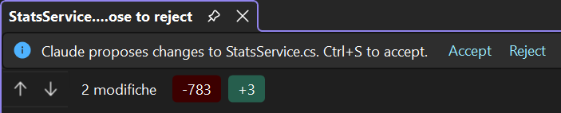

# Reviewing changes

Every Edit/Write the agent proposes shows up in the chat as an **inline diff** before anything
touches your files. You can review it there, or open it in Visual Studio's own diff to review — and
edit — with the full editor.

## Inline diff

Each Edit/Write tool row renders a diff: added/removed lines with configurable context
(**Options → Chat → Diff context lines**) and an optional **Ignore whitespace**. Expand it to a
full-screen viewer with four view modes:

- **Split** — side-by-side.
- **Unified** — one column, changes interleaved.
- **Patch** — the raw unified-diff text.
- **Auto** — split or unified depending on the available width.

## Open in Visual Studio

The **Open in Visual Studio** button (on by default — **Options → Chat**) hands the change to VS's
**native, interactive side-by-side diff** — the real editor on both sides, not a static rendered
diff.

This is where you accept or reject:

- **Save (Ctrl+S) → accept.** The CLI applies the edit. You can tweak the proposed side first — what
  you save is what gets applied, so the edit and your adjustments land together.
- **Close the tab → reject.** Nothing is written.

The CLI applies the edit **only** if you saved; closing without saving leaves the file untouched.
It's the same gate the agent's permission prompt would give you, but with the whole diff — and the
editor — in front of you.
