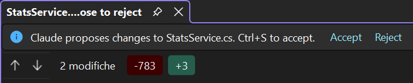

# Reviewing changes

Every Edit/Write the agent proposes shows up in the chat as an **inline diff** before anything
touches your files. You can review it there, or open it in Visual Studio's own diff to review — and
edit — with the full editor.

## Inline diff

Each Edit/Write tool row renders a preview of the diff: the added and removed lines with a few lines
of context around them, syntax-highlighted for the file's own language, and with the changed words
marked inside a line that was edited rather than rewritten. The row's title carries the counts —
`+3 −14`, the same numbers git would report.

The line numbers are the **file's**, not the fragment's, and come from the patch the CLI computes
when it applies the edit. While the tool is still running there is no patch yet: the preview shows
what is being changed without a line gutter, and gains the numbers once the edit lands.

Long lines wrap instead of scrolling sideways, so the preview reads in a docked tool window. A large
change is cut short — click it to see the whole thing in Visual Studio's own diff.

## Opening the file at the change

Clicking the path on an Edit row opens the file in Visual Studio with the **changed lines already
selected** — not the whole hunk: the context lines a patch carries either side are left out, so the
selection is what the agent actually wrote.

The range comes from the same patch the preview renders — the one the CLI produces when it applies
the edit — so the jump and the diff can never disagree about where a change is. Nothing is searched
for in the file, so it still lands correctly after the edit has been applied — the usual case — and
after later edits have moved the lines. A `Write` creating a new file has no patch and simply opens
it, as does a tool still running; a `MultiEdit` selects the first change.

Turn it off with **Select lines when opening file** (**Options → Chat**) to just open the file.

## Open in Visual Studio

Clicking the preview — or the **Open in Visual Studio** button on the row — hands the change to VS's
**native, interactive side-by-side diff**: the real editor on both sides, not a static rendered
diff. Clicking the same row again closes it; opening another change replaces it, so the chat never
leaves a trail of diff tabs behind.

This is where you accept or reject:

- **Save (Ctrl+S) → accept.** The CLI applies the edit. You can tweak the proposed side first — what
  you save is what gets applied, so the edit and your adjustments land together.
- **Close the tab → reject.** Nothing is written.

The CLI applies the edit **only** if you saved; closing without saving leaves the file untouched.
It's the same gate the agent's permission prompt would give you, but with the whole diff — and the
editor — in front of you.
