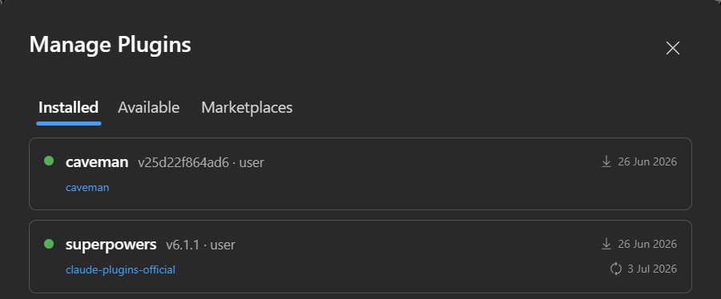
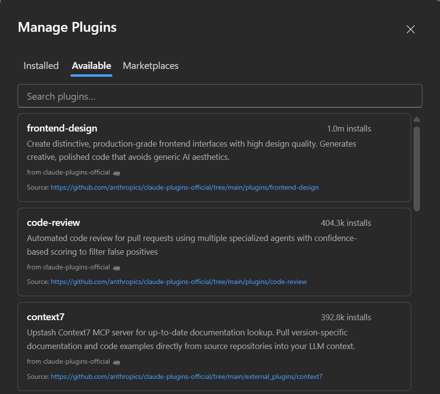
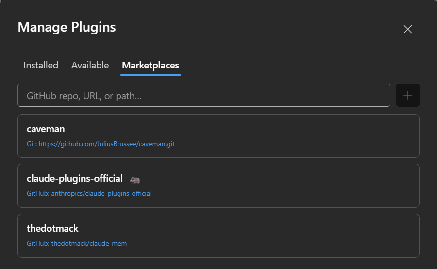

# Plugins

Manage Claude Code plugins without leaving the chat — install from a marketplace, enable or disable
what you have, and add marketplaces. Open it from the pane toolbar (**Manage plugins**).

Three tabs: **Installed**, **Available**, **Marketplaces**.

Plugin operations run as one-shot `claude plugin … --json` processes (the live chat process rejects
them), and when something changes every open chat gets a small "plugins changed" banner — restart or
reload so the change takes effect.

---

## Installed

Everything currently installed, each with its marketplace, version and enable/disable toggle. Turn a
plugin off to keep it installed but inactive; on to bring it back. Its skills, agents and MCP servers
follow the toggle.

---

## Available

Everything on offer across your marketplaces, with an install count. Install straight from here; the
plugin then shows up under **Installed**. Where a plugin has a home page, its name links out to it.

---

## Marketplaces

The marketplaces feeding the **Available** list. **Add** one by its source (a git URL or a local
path), and **refresh** a marketplace to pull its latest catalogue — the ↻ spins while it fetches.
Removing a marketplace drops the plugins it offered from **Available** (already-installed ones stay).

---

## How it works

Nothing runs against the live chat process — plugin changes go through short-lived `claude plugin`
invocations, so they can't disturb an in-flight turn. Because plugins live in the CLI's own store,
what you install here is the same set the CLI, the VS Code extension and the terminal see.
