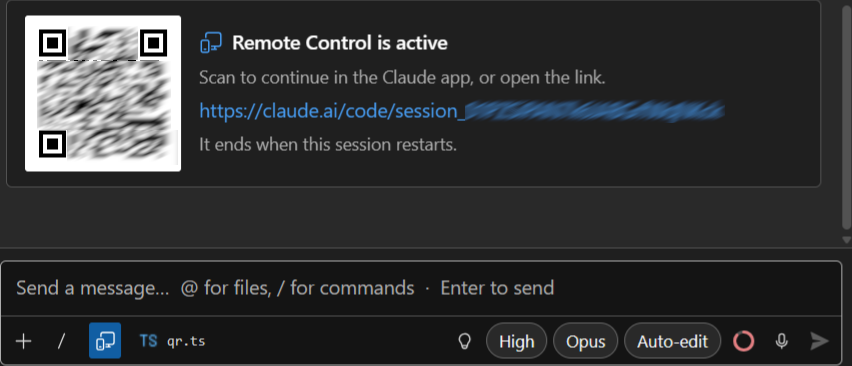

# Remote Control

Remote Control lets you drive a running chat session from `claude.ai/code` or the Claude mobile
app. The session itself keeps running on your machine, in this pane, talking to your solution and
your MCP tools — the web page and the phone are just a window onto it, not a copy of it.

## Turning it on

Run **`/remote-control`** (or the shorter `/remote`, `/rc`, `/phone`) from the `/` command menu. It
renders as a toggle, not a one-shot action: switching it on sends a control request to the running
CLI and waits for it to come up, switching it off tears the bridge down again. While the request is
in flight the toggle is briefly disabled, so a second click can't race the first.

## The link and the QR code

Once the CLI confirms the bridge is up, the session link is posted into the conversation, with a QR
code beside it:

The QR is the part that matters. On this machine the link is redundant — the session is already on
screen; what you need is a way to reach it from the phone you are about to pick up, and scanning
beats copying a URL. The link is there too, and opens in your default browser: the WebView never
navigates there itself.

It goes in the conversation rather than a banner above it because the link matters for a few
seconds, and a pinned row would spend a line of a narrow tool window on it for the rest of the
session. It scrolls away with everything else, and the toolbar indicator brings it back.

## The toolbar indicator

While the bridge is up, a filled indicator appears in the input toolbar, before the active-file
chip. It is the answer to "is this session still open to the outside?" without scrolling anywhere.

Clicking it opens a two-item menu: **Show link and QR code** posts the card again, further down the
conversation, and **Turn off Remote Control** tears the bridge down.

If the CLI can't establish the bridge — no login, a disabled feature flag, a stale CLI — that
surfaces as a dismissible error notice at the top of the chat instead, with the CLI's own reason
behind a short prefix.

## It dies with the pane

Remote Control lives inside the `claude.exe` process the pane is driving. Anything that restarts
that process — closing the pane, reloading a session from history, changing the working directory,
forking — ends the remote session along with it, and the indicator goes with it. This isn't a
choice this extension makes; it's how the CLI's control protocol works, and every pane in this
extension already respawns the process for those same actions.

Resuming a session does **not** bring Remote Control back: in the stream-json mode this pane uses,
the bridge only ever starts from an explicit request, so turn it on again if you want it.

A short network drop is not a disconnection. The bridge polls outwards and retries quietly, and the
CLI reports nothing while it does — the indicator stays on, which is what the connection is
actually doing.

## Requirements

Remote Control depends on things outside this extension, and when it fails, the cause is almost
always one of these:

- You need to be logged in to claude.ai (`/login`) — an API key alone isn't enough.
- It isn't available on Amazon Bedrock, Google Vertex AI, or Microsoft Foundry, and not with a
  custom `ANTHROPIC_BASE_URL` — Remote Control assumes the standard Anthropic API.
- On Team and Enterprise plans, an Owner has to turn Remote Control on in the organization's admin
  settings before anyone on the plan can use it.
- `DISABLE_TELEMETRY`, `DO_NOT_TRACK`, `CLAUDE_CODE_DISABLE_NONESSENTIAL_TRAFFIC` or
  `DISABLE_GROWTHBOOK` all disable the feature-flag check Remote Control relies on to know it's
  available, so any of them set will keep it off.

For the full picture of the underlying feature — what the web and mobile side look like, how the
session syncs — see the upstream docs at
[code.claude.com/docs/en/remote-control](https://code.claude.com/docs/en/remote-control).
