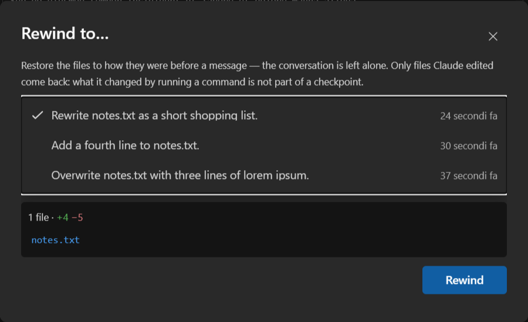

# Rewinding files

Claude keeps a copy of every file **before** it edits one. `/rewind` puts them back the way they
were before a message you pick — without touching the conversation, which stays exactly where it
is.

It is the answer to "that last hour went the wrong way": the files return to a known point while
the chat keeps the context that got you there.

## Using it

Run **`/rewind`** from the command menu (**Context → Rewind files…**). The dialog lists the
messages this session can go back to, newest first, and clicking one shows what returning there
would change:

The panel under the list is the answer to "what happens if I press this": how many files, how many
lines added and removed, and which files. Clicking a message never touches them — the figures come
from asking the CLI what it *would* do. Only the **Rewind** button writes anything, so the list is
meant to be browsed.

Clicking a **file** opens it in Visual Studio's own diff: the copy from before that message on the
left, what is on disk now on the right. It is the same viewer the chat uses to
[review a change](diff.md), so the two sides are real editors.

With more than a handful of messages a filter box appears above the list. The arrow keys walk the
list — while you are still typing in the filter — and Home/End jump to the ends.

## What comes back, and what does not

Only files **Claude edited through its own file tools** are covered. What it changed by running a
command — `sed`, `git checkout`, a build script, a shell redirect — is not part of a checkpoint and
stays as it is. A rewind after a turn that mixed the two puts back one half and leaves the other.

Directory operations are not covered either: a folder created, moved or deleted stays that way.

A file the message **created** has no earlier version to restore, so rewinding past it **deletes**
it. Its diff shows an empty left-hand side, which is what that means.

Messages that changed no file are not listed at all — there would be nothing to restore.

## Where the copies live

Under `~/.claude/file-history/<session-id>/`, one folder per session, holding whole files rather
than diffs. They belong to the CLI, are private to their session, and **are not cleaned up**: they
stay until the folder is deleted. **[File history](../file-history.md)** shows what they cost across
every session, and deletes the ones you no longer want.

That is the reason the feature can be turned off. **Keep file checkpoints (Rewind)**
(**[Options → Chat → Files](../options.md#chat)**, on by default) decides whether the CLI takes
them at all. With it off no copies are written, and the `/rewind` command is hidden rather than
offered as something that can only decline.

The setting is read when a chat starts, so changing it leaves any chat already open as it was —
the pane says so when you apply it, and the next chat you open follows the new value.

## Limits worth knowing

- **100 restore points per session.** The CLI keeps the most recent hundred; past that the oldest
  stop being reachable. The copies themselves stay on disk.
- **One session only.** A checkpoint belongs to the session that took it, so `/rewind` offers this
  chat's messages and no others.
- The conversation is never rewound. To go back in the conversation as well, use **Fork** on the
  message — it opens a new pane from that point and leaves this one alone.
