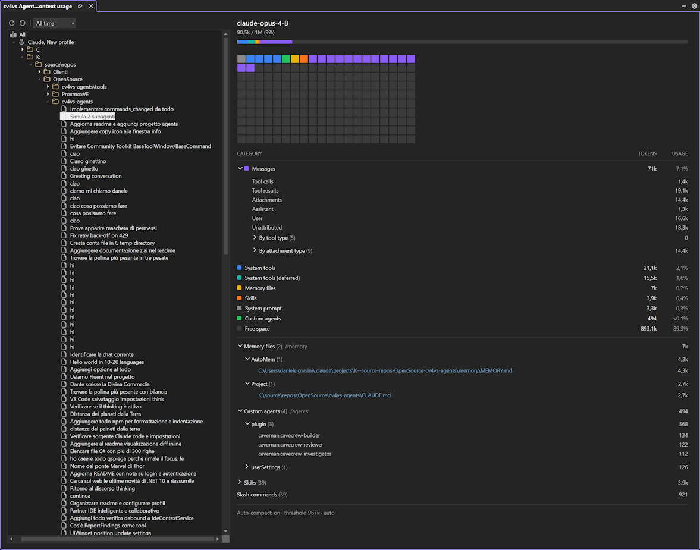

# Context usage

A full-window view under **View → cv4vs Agents → Context usage**: for any historical session, how it
fills the model's context window — model, categories, a memory-map, and the files/agents/skills/tools
loaded into context. It opens as a document-tab in the editor area, next to [Statistics](statistics.md)
and [Usage](usage.md). (For the current chat's context, use the in-chat gauge —
see [Context, usage & statistics](chat/context-and-usage.md).)

### The tree (left)

The same scope tree as Statistics — **All → Profile → Folder → Project → Session** — but **without the
calendar levels**: a project expands straight to its sessions, one row per session file (titled from
the chat). Context is per-session, so only a **Session** is clickable for the breakdown; the
intermediate nodes (All / Profile / Folder / Project) only navigate — until you pick a session the
right side shows "Select a session".

The **Range** selector (7 days / 30 days / All time) filters the tree, and **Refresh** re-reads
changed sessions (and re-fetches the visible one).

### The breakdown (right)

Clicking a session loads its context window (see *How it works*), then shows — mirroring the in-chat
context dialog:

- **Header** — the model id and `used / max (percent%)`.
- **Gauge bar** — a segmented bar coloured per category, sized by each category's share of the window.
- **Memory map** — a grid of cells, one per slice of the window, coloured by the category that fills
  it (empty cells stay grey). Hovering a cell shows its category and tokens.
- **Category table** — CATEGORY / TOKENS / USAGE, one row per category (System prompt, System tools,
  Custom agents, Memory files, Skills, Messages, Free space…), each with a colour dot matching the
  bar. **Messages** expands into its parts (tool calls, tool results, attachments, assistant/user
  messages…).
- **Trees** — expandable sections for Memory files (`/memory`), Custom agents (`/agents`), Skills, MCP
  tools and Slash commands, each grouped by source with per-item tokens. **Memory-file paths are
  links** — click one to open the file in the editor.
- **Footer** — the auto-compact state (on/off, threshold, source).

### How it works

Reading a closed session's context requires loading its messages, so the tab spawns a short-lived
`claude.exe` that resumes that session and asks the CLI for `get_context_usage` — a read-only
calculation (token counting), no message is sent and the session file is not modified. The first fetch
takes a few seconds; the result is cached in memory, so re-selecting the same session is instant.
Refresh drops the cached value and fetches again. This complements the in-chat context gauge, which
covers the **current** session — the tab is for any **historical** one.
