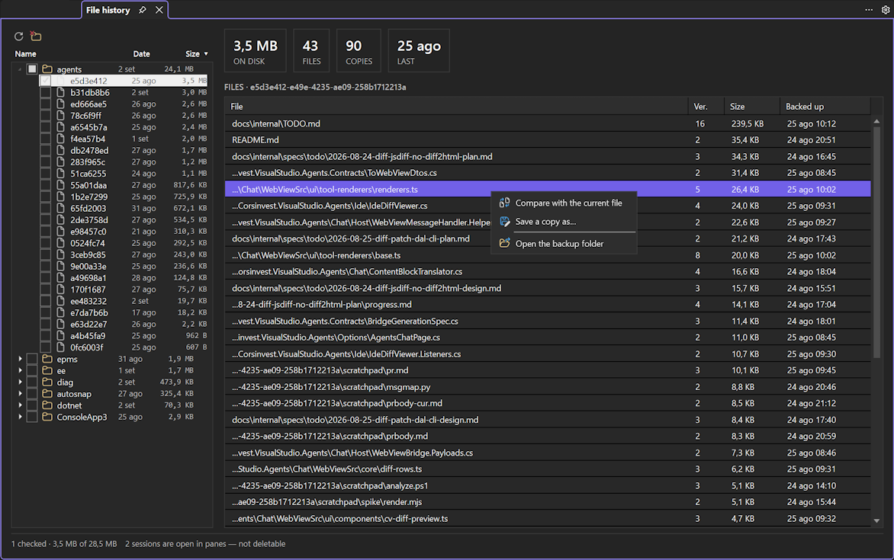

# File history

A full-window view under **View → cv4vs Agents → Analytics → File history**: what the CLI's file
backups occupy on disk, which files each session preserved, and a way to delete the ones you no
longer want. It opens as a document-tab in the editor area, next to [Statistics](statistics.md),
[Usage](usage.md) and [Context usage](context-usage.md).

## What it reads

Before overwriting a file, the CLI copies it into `~/.claude/file-history/<session>/`. Those copies
are what a rewind restores from — and **nothing prunes them**: they stay after the session ends, and
after the transcript itself is deleted. On a development machine a few dozen sessions come to tens of
megabytes.

The copies are named by a hash of the path plus a version (`072f0f4b…@v6`), so the folder alone can't
say which file a copy belongs to. That mapping lives in the session transcript, in the
`file-history-snapshot` records — which is why the file list is read only when you select a session.

Everything here is read from the local `~/.claude/` of each configured profile. No CLI process is
started and nothing is sent anywhere.

## The tree (left)

**Config-dir → project → session**, with the newest backup date and the size on every row. Sessions
are the leaves: a row is one `file-history/<session>/` folder.

- The **config-dir** level appears only when profiles resolve to more than one. Several profiles
  usually share `~/.claude`, and a tree rooted on profiles would count the same megabytes twice, so
  the root is the directory — the tooltip names the profiles using it.
- **Sessions no longer on disk** is a group of its own, last in the list: backups whose transcript is
  gone. Nothing else refers to them, which makes them the first thing worth deleting. Their real file
  paths can't be recovered — without the transcript, only the folder is left to open or delete.

Click **Name**, **Date** or **Size** to sort; click the same header again to reverse it. The
ordering applies to every level at once, and an arrow marks the column in effect. There is no date
*filter* on purpose: it would hide exactly the old sessions this view exists to find.

**Refresh** re-reads the folders. Nothing is indexed and nothing is cached — the sizes come from the
filesystem, which already knows them.

## The files (right)

Selecting a session shows what it backed up: **file, version, size, and when the copy was taken**,
newest-largest first. The tiles above give the session's totals — size on disk, distinct files,
copies (one per version of each file), and the date of the last one.

- **Double-click a row** — or **Compare with the current file** — opens a diff between the backup and
  the file as it is now, in Visual Studio's own diff viewer.
- **Save a copy as…** writes the backup wherever you choose. It is deliberately *not* called
  "Restore": it saves a file and leaves both your working copy and the conversation alone. Going back
  in a conversation is [rewind](chat/rewind.md), which lives in the chat pane.
- **Open the backup folder** shows `file-history/<session>/` in Explorer.

A transcript can name a copy the CLI has since pruned; such rows are left out rather than shown as
entries that can be neither diffed nor saved.

## Deleting

Tick sessions in the tree — a parent ticks everything under it — and press the delete button. The
confirmation names how many sessions, copies and files go, and how many megabytes that frees.

Two things are worth knowing before you press it:

- **Your project files are never touched.** Only the copies under `file-history/` are removed.
- **The copies are gone for good**, and rewinding those sessions stops working. The transcript keeps
  the records, but the files they point at will not be there.

A session that an open pane is driving **cannot** be deleted: its checkbox is disabled and the status
bar says how many are held that way. Deleting the copies a live rewind restores from would break it
half-way, so the consequence sits in the control rather than in a warning you can click past.

## What it is not

This is an archive, not a second rewind. It shows and deletes; it never writes into a conversation.
Restoring files *and* moving a session back is [rewind](chat/rewind.md), and it only works on the
session its own pane is driving — the running CLI knows nothing about the others.
