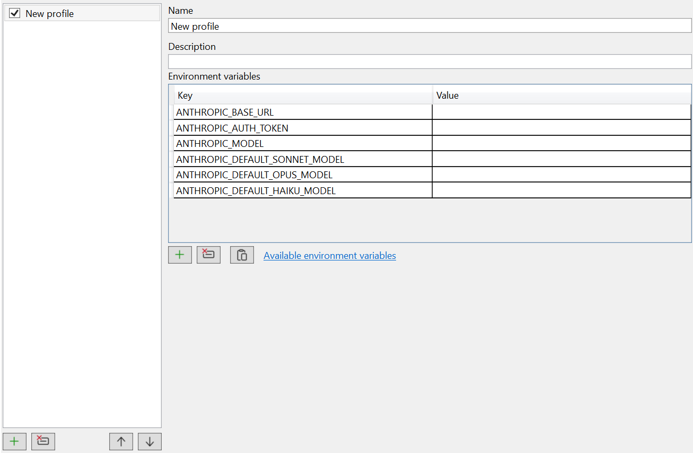

# Options

All settings live under **Tools → Options → cv4vs Agents**, split into four pages: **General**,
**Chat**, **Debug** and **Profiles**.

Visual Studio persists them in its own settings store; profiles, per-solution state and caches
go to `%LOCALAPPDATA%` — see [Settings and data](settings-and-data.md).

## General

| Setting | Type | Default | Description |
|---|---|---|---|
| Restore panes on solution open | bool | `false` | Reopen the panes (with their sessions) that were open for a solution when it is reopened. |
| Select lines when opening file | bool | `true` | When opening a file from a tool row, select the relevant lines in the editor. |
| Default new session | `Chat` / `CLI` | `Chat` | Which kind the "New" button creates by default (the dropdown still lets you pick the other). |
| Claude executable path | file path | *(empty)* | Override auto-detection with a specific `claude.exe` (browse with `…`). Empty = auto-detect via PATH / native installer / npm. Must be the real `.exe` — `.cmd`/`.bat`/`.ps1` shims can't be launched. |

## Chat

| Setting | Type | Default | Description |
|---|---|---|---|
| Show cost and duration | bool | `false` | Show cost (USD) and duration after each response. |
| Show relative paths in tool rows | bool | `true` | File paths relative to the working directory (full path if outside it). |
| Preview lines | int | `3` | Lines shown in preview areas (tool output, user messages). `0` = no preview. |
| Chat font size | int (px) | `13` | Font size of the chat message text. |
| Autosave before Claude reads/writes | bool | `true` | Save a dirty file before Claude reads/writes it, so it sees your in-editor edits, not the stale on-disk version. |
| Send post-edit diagnostics to Claude (experimental) | bool | `false` | Feed back the new errors/warnings an edit introduced. Experimental — unreliable because VS only analyses files open in an editor (see IDE integration). |
| Allowed upload file extensions | string[] | ~120 defaults | Extensions accepted on upload/drop. Images → images, `.pdf` → document, rest → text; anything else rejected. Editable list. |
| Sticky user messages | bool | `true` | Pin the current exchange's user message at the top while the reply/tool rows scroll below. |
| Show tool errors inline | bool | `false` | Show the tool error inline below the diff/output; off = alert icon only (click to open in VS). |
| Compact Ask answers | bool | `true` | After an `AskUserQuestion`, show only the chosen option per question (compact); off = all options with the pick highlighted. |
| Use Ctrl+Enter to send | bool | `false` | On: Ctrl+Enter sends, Enter = newline. Off: Enter sends, Shift+Enter = newline. |
| Initial permission mode | `Default` / `AcceptEdits` / `Plan` | `Default` | Mode every new chat starts in (changeable per-session from the toolbar). `Default` = ask before edits. |
| Allow dangerously skip permissions | bool | `false` | Enables the toolbar's "Bypass permissions" (never asks — even for dangerous commands). |
| Diff — preview context lines | int | `10` | Context lines around changes in the inline diff (the expand dialog always shows the full diff). |
| Diff — ignore whitespace | bool | `false` | Ignore leading/trailing whitespace when computing the diff. |
| Diff — show "Open diff in Visual Studio" button | bool | `true` | Show the VS-icon button on Edit/Write rows that opens the change in VS's native diff viewer. |
| Respect `.gitignore` | bool | `true` | Also hide `.gitignore`-matched files/folders from the `@` picker (re-read on change, cached otherwise). |
| Ignored patterns | string[] | ~30 defaults | Patterns hidden from the `@` picker: exact name, `.ext`, or `*`/`?` glob. Editable list. |

## Debug

| Setting | Type | Default | Description |
|---|---|---|---|
| Log level | `None`…`Trace` | `None` | Output-window verbosity. `None` = silent; `Trace` = include bridge traffic. |
| Enable performance logging | bool | `false` | Performance-span logging in the Output window (C#) and browser console (JS). Requires a VS restart. |

## Profiles

Not a settings table but an editor: each profile is a named set of environment variables (e.g.
`ANTHROPIC_BASE_URL`, `ANTHROPIC_AUTH_TOKEN`, model overrides) injected into that pane's
`claude.exe`, so a pane can run on a different provider while the IDE MCP tools keep working.

Profiles are listed on the left (the checkbox enables one), and edited on the right: a name, an
optional description, and the environment grid — pre-filled with the keys you are most likely to
need, so a new profile is usually just a matter of pasting two values. **Available environment
variables** links to Anthropic's reference for everything else the CLI understands.

Enabled profiles appear under **View → cv4vs Agents**, and the active one is shown in the pane
caption and toolbar.

Unlike the other three pages, profiles are **not** stored in the VS settings store: they live in
`profiles.json` so the menu can list them without opening the Options page first — see
[Settings and data](settings-and-data.md).

### Paste from JSON

The editor's **Paste from JSON** button fills the env grid from the clipboard, so you can lift a
provider's snippet straight from its docs. It accepts either a full settings block —
`{ "env": { "ANTHROPIC_BASE_URL": "…", "ANTHROPIC_AUTH_TOKEN": "…" } }` — or a plain key/value map
`{ "ANTHROPIC_BASE_URL": "…", … }`; the `env` object is used when present, otherwise the whole
object.

Profiles are not the only way: the CLI reads these variables from the process environment like any
shell would, so setting them **at the OS level** works too. Profiles are usually preferable — one
pane per provider, switchable without touching your system environment.

> **Heads-up:** pointing `ANTHROPIC_BASE_URL` at a custom host can disable the IDE MCP tools. That
> is a CLI-side restriction, not something the extension controls.

### Provider setup guides

- [z.ai / GLM](https://docs.z.ai/devpack/tool/claude) — GLM, Kimi, DeepSeek, Qwen, MiniMax
- [Qwen](https://qwenlm.github.io/qwen-code-docs/en/users/configuration/model-providers/) — DashScope Anthropic API
- [MiniMax](https://www.minimaxi.com/) — Anthropic-compatible models
- [DeepSeek](https://api-docs.deepseek.com/guides/anthropic_api/) — direct Anthropic API compatibility
- [OpenRouter](https://openrouter.ai/blog/tutorials/claude-code-openrouter/) — multi-provider gateway
- [Ollama](https://docs.ollama.com/api/anthropic-compatibility) — local open-source models
- [Complete alternative models guide](https://github.com/Alorse/cc-compatible-models) — comprehensive provider list
