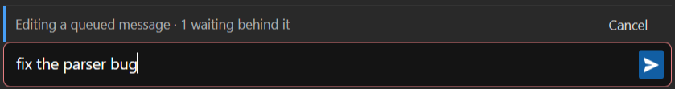

<!--
SPDX-FileCopyrightText: Copyright Corsinvest Srl
SPDX-License-Identifier: GPL-3.0-only
-->

# Messages waiting to be sent

You do not have to wait for an answer to write the next message. Type it while the turn is running
and it is **queued**: the bubble appears straight away, greyed out so it does not read as already
sent, and goes to the CLI the moment the turn ends.

Which leaves what this page is about: reading what is still waiting, fixing one you got wrong,
dropping it, or sending two of them as a single message.

## Where it lives

A chip in the composer's toolbar, next to the sub-agent one, counting what is waiting. It is there
only while something is — with an empty queue it takes no room at all.

## The list

Click the chip and every message that has not been sent yet is there, in the order it will go out.
That order is the one thing the greyed-out bubbles do not show at a glance — and by the time a turn
has been running for a while, those bubbles have usually scrolled out of view, which makes this the
only place left to read what is about to be sent. A long message is clipped to the row; its full
text is in the tooltip.

Each entry carries two actions, shown when the pointer is over it:

| | |
|---|---|
| **pencil** | bring the message back into the composer |
| **bin** | delete that one message |

The whole row is the pencil's target too — the icon is there to say so. At the top of the list,
**Clear all** empties the queue. It is spelled out rather than given an icon on purpose: it sits a
few pixels from the rows' own bins and takes everything instead of one, and position alone is a thin
thing to tell those two apart.

## Fixing a queued message

Clicking an entry brings its text and attachments back into the composer, and a bar above it says
you are editing something queued rather than writing a new message. Change it and press Enter: it
goes back to **its own place** in the queue, not to the end.

The entry does not leave the queue while you edit — it holds its place and **the queue waits there**.
Anything behind it waits too, which is why the bar also counts what is held up. Without that the
queue could reorder itself behind your back: take the entry out, let the turn end, and the messages
after it would go while yours, no longer queued, arrived last.

If the turn ends mid-edit nothing is sent, and the bar stays: with the turn over it is the only
thing saying the queue is still there and still waiting on you.

The **cross** on that bar puts the entry back as it was. Not Esc — that stops the turn and clears
the queue with it, as it always has. A cross there and a bin in the list are deliberate: one closes
what you opened, the other deletes something.

## Sending two messages as one

Three messages that correct one another are no use arriving a turn apart: Claude answers the first
without having seen the rest.

**Alt+Enter** queues a message *into* the one before it instead of after it. They stay two entries in
the list, each with its own pencil and cross, joined by a rule down their left — and they leave
together, as a single message, with the attachments of both.

Plain Enter queues as it always did. Alt+Enter needs something already in the queue to join, so with
an empty queue it stays what it has always been: a newline — and the composer says so, offering the
shortcut only once there is an entry to join.

## Why not just Stop

Stop does clear the queue — but it interrupts the running turn as well, and that is rarely what you
want when the problem is one message you regret. Stop is for stopping; this is for the queue.

Nothing is sent to the model either way: a queued message was never given to the CLI, so removing it
leaves no trace in the conversation. The bubble goes with it.

## See also

- [Options](options.md) — Enter vs Ctrl+Enter to send, and the rest of the composer's behaviour.
