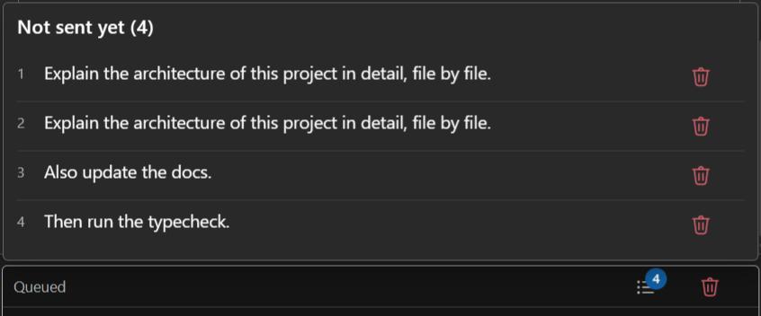

<!--
SPDX-FileCopyrightText: Copyright Corsinvest Srl
SPDX-License-Identifier: GPL-3.0-only
-->

# Messages waiting to be sent

You do not have to wait for an answer to write the next message. Type it while the turn is running
and it is **queued**: the bubble appears straight away, greyed out so it does not read as already
sent, and goes to the CLI the moment the turn ends.

Which leaves the case this page is about — you queued something and then thought better of it.

## The row above the composer

It is there only while something is waiting, so it takes no space the rest of the time. What it
shows depends on how much is in the queue:

| Queued | The row |
|---|---|
| **one** | its text, and a bin |
| **more** | a count that opens the list, and a bin |

With one message there is nothing to choose between, so its text sits in the row and the bin has a
visible target. Past that the text no longer fits — the count opens the list instead.

The **bin empties the queue**. It stays in the same place in both forms, so it can be hit without
looking.

## The list

Click the count and every message that has not been sent yet is there, in the order it will go out,
each with a bin of its own. That order is the one thing the greyed-out bubbles do not show at a
glance — and by the time a turn has been running for a while, those bubbles have usually scrolled
out of view, which makes this the only place left to read what is about to be sent.

Removing one leaves the rest alone. Take out the second-to-last and the row drops back to its
single-message form, closing the list with it.

## Why not just Stop

Stop does clear the queue — but it interrupts the running turn as well, and that is rarely what you
want when the problem is one message you regret. Stop is for stopping; this is for the queue.

Nothing is sent to the model either way: a queued message was never given to the CLI, so removing it
leaves no trace in the conversation. The bubble goes with it.

## See also

- [Options](options.md) — Enter vs Ctrl+Enter to send, and the rest of the composer's behaviour.
