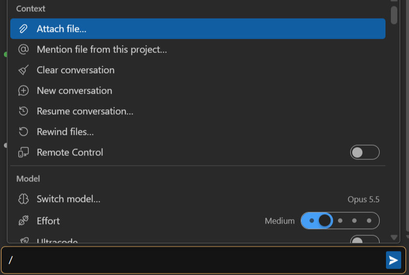
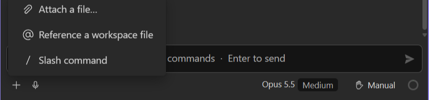
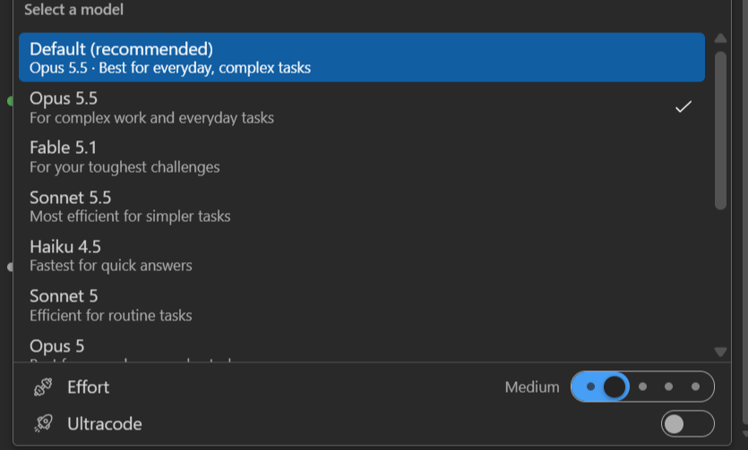

The composer is the input area at the bottom of a Chat pane: the prompt, and under it a toolbar with
everything that shapes the next turn. From left to right the toolbar holds **Add** (+), the
microphone, the sub-agent, queue and Remote Control chips while they have something to show, the
editor-context chip, then the model button, the permission button and the context gauge.

## Writing and sending

- **Multi-line prompt** with Send/Stop, Enter-to-send (or Ctrl+Enter, configurable),
  Shift+Enter for a newline. The placeholder names the keys in force, and so does the send button's
  tooltip.
- **Write while it is still answering**: the message is held until the turn ends, then sent. Its
  bubble appears straight away, greyed out so it does not read as already sent, and drops into place
  below the reply it was waiting on, so each answer stays under the question that prompted it. A chip
  in the composer's toolbar lists what is still waiting and takes one back out, without stopping the
  turn to do it; see [Messages waiting to be sent](/cv4vs-agents/chat/queued-messages/).
- **Notices** appear above the prompt: rate limits, a refused attachment, a turn that ended without
  an answer. See [The conversation](/cv4vs-agents/chat/conversation/#notices).

### Prompt history

↑ and ↓ recall previous prompts, shell-style. ↑ recalls only when the caret is on the first line of
the prompt and ↓ only from the last, so the arrows still move inside a multi-line draft. The draft
you were writing comes back when you go past the newest entry. History is per session, seeded from
the session you opened, and a prompt sent twice in a row is stored once.

## The slash palette

Typing `/` opens the palette and filters it as you type: at the start of any word, not only at the
start of the prompt. With the mouse: the **Add** (+) button at the left of the toolbar, then **Slash
command**, which opens the same list with a search box.

The filter is fuzzy, over each entry's name, its aliases and its description; a row's tooltip lists
its aliases, which is why typing `/rewind` or `/rc` finds entries that are not called that. ↑/↓ and
PageUp/PageDown move, Enter or Tab picks, Esc closes. Switches and sliders act in place and keep the
menu open.

| Section | Entries |
|---|---|
| **Context** | Attach file…, Mention file from this project…, Clear conversation, New conversation (a new pane), Resume conversation… (the session list), Rewind files… (hidden when checkpoints are off), Remote Control (a switch) |
| **Model** | Switch model…, Effort, Ultracode, Switch permission mode…, Thinking, Fast mode, Switch models when a message is flagged, Account & usage…, Context usage…, Statistics… |
| **Customize** | Manage plugins, Open Claude in Terminal |
| **Slash Commands** | the CLI's own commands and skills, each with its argument hint |
| **Settings** | View mode (a slider: Full, Focus, Hide tools), Enable Remote Control for all sessions, Settings… |
| **Support** | View help docs, Report a problem |

Three rules worth knowing:

- **Picking a CLI command from the list sends it at once, with no arguments.** To pass arguments,
  type the whole line (`/review 123`) and press Enter: the list closes at the first space.
- A message starting with `/` never carries the editor context.
- `/clear` and `/compact` picked while a turn runs are sent immediately rather than queued.

## Mentions and attachments

- **`@` mentions**: inline file picker over the **whole** project tree: no depth limit, and the
  filter matches the *path*, not just the file name, so `ui/comp` narrows before you type a name.
  It lists folders too: picking one inserts `@folder/`. A path with a space is written `@"…"`.
  Honours `.gitignore`, your own ignore patterns, and git's `core.excludesFile`.
- **Attachments**: **Add** (+) → **Attach a file…**, drop files on the composer (from Explorer too;
  a dropped folder is skipped), or paste, files as well as image data. They become removable chips;
  clicking a chip before sending previews it. Images are sent as images, PDFs as documents, the rest
  as text.
- A file whose extension is not allowed is refused with *Unsupported file types: …* and an **Open
  settings** button; the list is **Allowed upload file extensions** in
  [Options → Chat](/cv4vs-agents/options/#chat).

The file open in the editor is attached by itself, as a chip: see
[Editor context](/cv4vs-agents/ide-integration/).

## Model, effort and thinking

The model button names the model and its effort level. Click it for the list (**Select a model**);
models your account cannot use are listed greyed out. **Default** follows Claude Code's own
recommendation. Under the list:

- the **Effort** slider, with the levels the current model offers (Low, Medium, High, Extra high,
  Max);
- **Ultracode**, where the model supports it: dynamic workflows on every task, for this session
  only.

A model with no effort levels shows neither.

 Picking another model mid-conversation posts a
*Switched to …* line in the transcript.

The `/` menu's **Model** section has the same two controls plus three switches:

| Switch | What it does |
|---|---|
| **Thinking** | extended reasoning before answering |
| **Fast mode** | faster responses on supported models |
| **Switch models when a message is flagged** | switch model when safety flags a message, instead of pausing the session |

A switch the current model does not support is not listed. Model, permission mode and interrupt
change on the live process, never a restart.

## Permission mode

Shift+Tab cycles it, and while the composer has focus its border takes the mode's colour, so the
change is visible where you are already looking. The modes and what each one asks are in
[Permissions](/cv4vs-agents/chat/permissions/).

## Keyboard

| Key | Does |
|---|---|
| Enter | send; with **Use Ctrl+Enter to send** on, a newline |
| Ctrl+Enter | send, with **Use Ctrl+Enter to send** on |
| Shift+Enter | newline |
| Alt+Enter | join this message to the last queued one; needs a running turn and something queued, otherwise a newline |
| ↑ / ↓ | previous and next prompt (from the first and last line); move in an open list |
| PageUp / PageDown | a page at a time in an open list |
| Tab | in an open list, pick the highlighted entry, like Enter |
| Shift+Tab | cycle the permission mode |
| Home / End | start and end of the line; with Ctrl, of the whole text. Outside a text field they scroll the conversation to its top or bottom |
| Ctrl+F | the chat's own find bar, not Visual Studio's Find |
| Esc | close what is open (a list, the edit of a queued message); on an approval prompt it answers **No**, on a question it cancels it; it stops the turn only when nothing is open |

The keys of the approval prompt are in [Permissions](/cv4vs-agents/chat/permissions/#approving-a-tool).

## Voice input

Dictate the prompt instead of typing it: a mic button in the composer transcribes as you speak (Web
Speech API). The mic pulses while recording, and is hidden when the platform doesn't support it.
Dictation uses the browser's language and inserts at the caret, keeping the text on both sides.

## Related options

**Use Ctrl+Enter to send**, **Spell check in the composer**, **Send the selected text with the
message** and the `@` picker's ignore rules are under
[Options → Chat](/cv4vs-agents/options/#chat).
