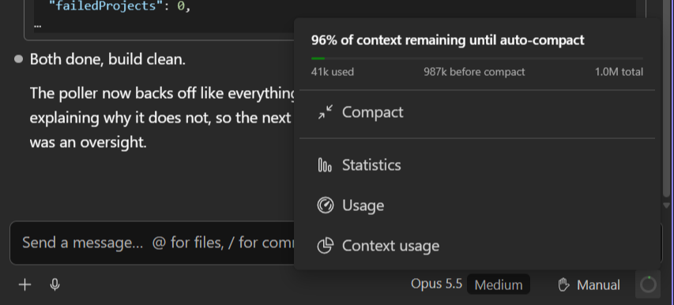
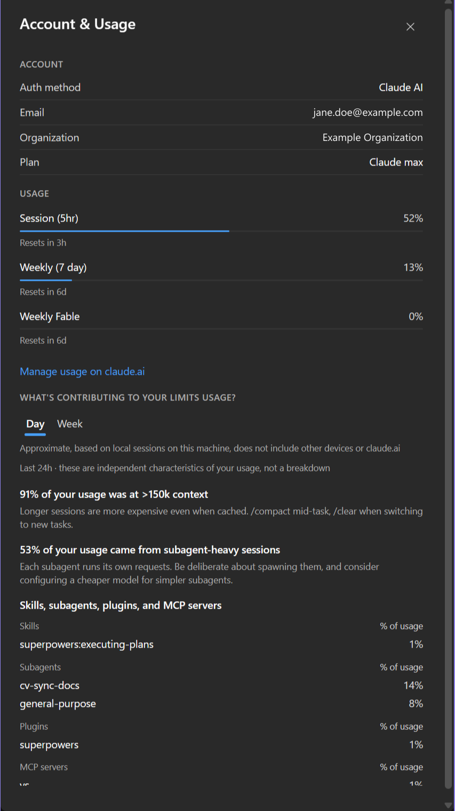
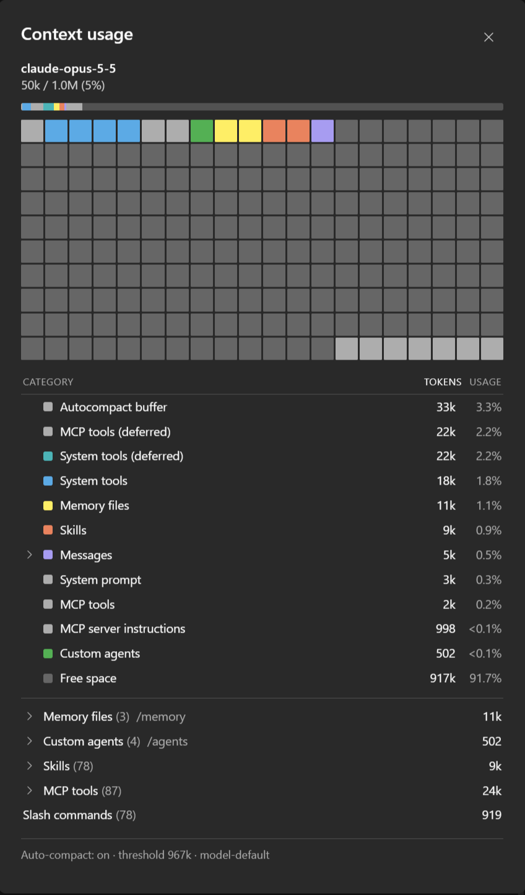
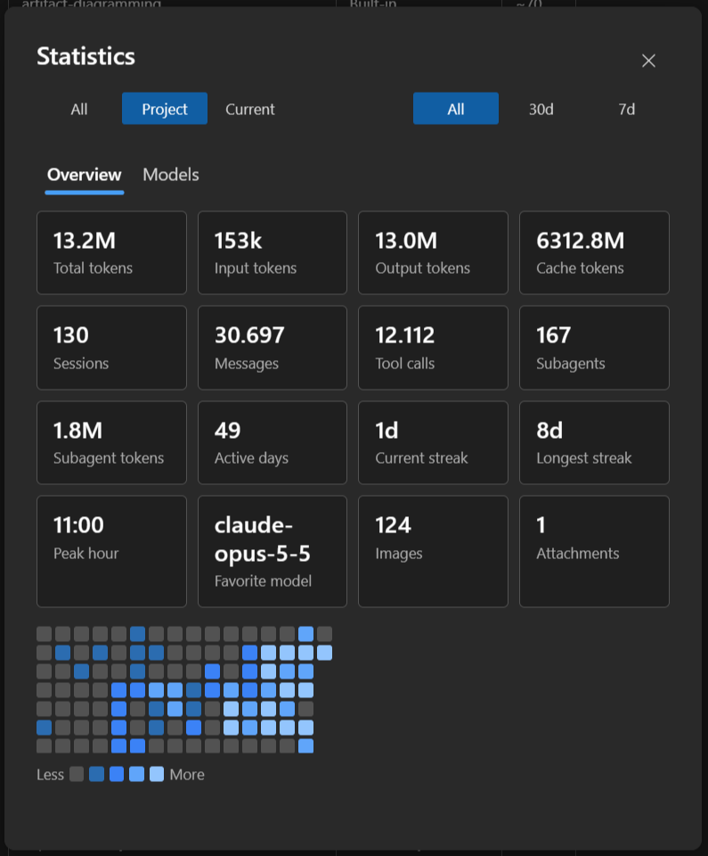

Four related views, reachable from the **context gauge** in the composer toolbar: how full the
current context window is, what is filling it, what your plan allows, and what you have spent
over time.

## The gauge

A circular token-usage gauge sits in the composer, filling as the conversation grows: green,
orange from 60% of the model's window, red from 85%. The number in its tooltip and in the panel is a
different measure: what is left before the CLI compacts.

Clicking it opens a small panel: how much is left before auto-compact, a bar with used / before
compact / total, **Compact** to compact the conversation now (not while a turn is running), and
**Statistics**, **Usage** and **Context usage** for the three dialogs below. Until the first reply
of a session there are no numbers and the ring is empty.

`61% of context remaining until auto-compact` is the number that matters day to day: not how much
you have used, but how much room is left before the CLI compacts the conversation.

### The prompt cache

Every message makes the model read the whole conversation again. The API keeps what it already
processed in a **prompt cache**, so the next message reads that part back cheaply instead of paying
for it in full, but only for a while: the cache lives **5 minutes or 1 hour**, and every message
that uses it starts the clock again.

A tooltip says where that stands:

- *Prompt cache warm, about 42 min left*: keep going and the next message is cheap. The gauge's
  own tooltip carries this: while the cache holds there is nothing to act on.
- *Prompt cache expires in about 3 min. Send your next message before then to keep it.*: a
  **yellow clock** appears next to the gauge: 5 minutes before the end of a 1-hour cache, 1 minute
  before the end of a 5-minute one. If you still have something to ask, now is the cheap moment.
- *Prompt cache likely expired (idle 3h 31m). Your next message re-caches about 71k tokens.*: the
  clock turns **orange**, and carries that tooltip itself. The next message still works, but it
  writes the whole conversation into the cache again, which costs more and takes a little longer.
  For a quick question on a long, idle conversation, a fresh chat can be the cheaper choice.
- *Prompt cache does not cover the compacted conversation.*: the same orange clock right after a
  compaction, however recent the last message: the cache holds the conversation as it was, not the
  summary that replaced it, so the next message caches that summary anew.

The clock appears and changes on its own while the chat sits idle, which is when the cache runs
out, without waiting for a message to redraw it.

It is an estimate, and says so: the API reports which lifetime it gave the cache on every message,
but never whether the entry is still alive, so the gauge counts from the last message's time. Which
lifetime you get is the CLI's choice: one hour on a Claude subscription's main conversation, five
minutes on an API key or once you are on extra usage, which is why it is read from each message
rather than assumed. A reopened session is judged by when its last message was sent, not by when you
opened it.

## Rate-limit notices

When the plan's limits come into play a notice appears above the composer, in the CLI's own terms:

- *You've hit your session limit · resets in 2h*: an error, the window is closed until then;
- *You've used 82% of your weekly limit · resets in 3d*: a warning;
- *Approaching weekly Opus limit*: a warning for one model's window.

The windows it can name are the session limit, the weekly limit, the weekly Opus and Sonnet
limits, and the usage credit limit. The notice clears by itself when the CLI reports the window
allowed again.

## Account & usage

Account information and the plan's rate-limit windows: what you are allowed, and how much of it
is left in the current window. Read live from the CLI, not computed here. Like the
Usage tab it also has **What's contributing to your limits usage?**, with Day / Week.

The full-window version, for every profile, is [Usage](/cv4vs-agents/documents/usage/).

## Context usage

What is actually filling the context window right now.

The grid at the top is a memory map: one cell per slice of the window, coloured by category, so
the shape of the problem is visible at a glance: a wall of purple means the conversation itself is
the weight; a band of blue means tool definitions are.

Below, the same data as a table: messages, system tools, memory files, skills, MCP tools, custom
agents, system prompt, and free space, each with tokens and percentage. The expandable rows at the
bottom list what is loaded: which memory files, which agents, which skills, which MCP tools.

The footer shows whether auto-compact is on and at what threshold.

For a session that is not the current one, see
[Context usage](/cv4vs-agents/documents/context-usage/).

## Statistics

Historical usage, aggregated **locally** from the CLI's own session files.

Two tabs (**Overview** and **Models**) and two selectors that decide what is counted:

| Scope | Counts |
|---|---|
| **Current** | this chat only |
| **Project** | every chat in this project |
| **All** | every chat, across every project |

| Range | Period |
|---|---|
| **All** | everything on disk |
| **30d** / **7d** | the last 30 or 7 days |

The dialog opens on **Project**. The chart stacks tokens per day by model (per week, with more than
35 days in range); hovering a bar breaks that day down. Below, each model
with its share, and input/output tokens.

Model names are shown **exactly as the API returned them** (`claude-opus-4-8`, not "Opus 4.8"), so
a third-party provider's model ids stay readable instead of being mapped onto Claude names.

How the numbers are computed and cached is in
[Statistics](/cv4vs-agents/documents/statistics/#how-it-works), the full-window version of this
dialog, with a tree to pick the scope from.

## Spending less context

The gauge tells you the window is filling; what you can actually do about it is in
[Spending less context](/cv4vs-agents/guides/spending-less-context/).
