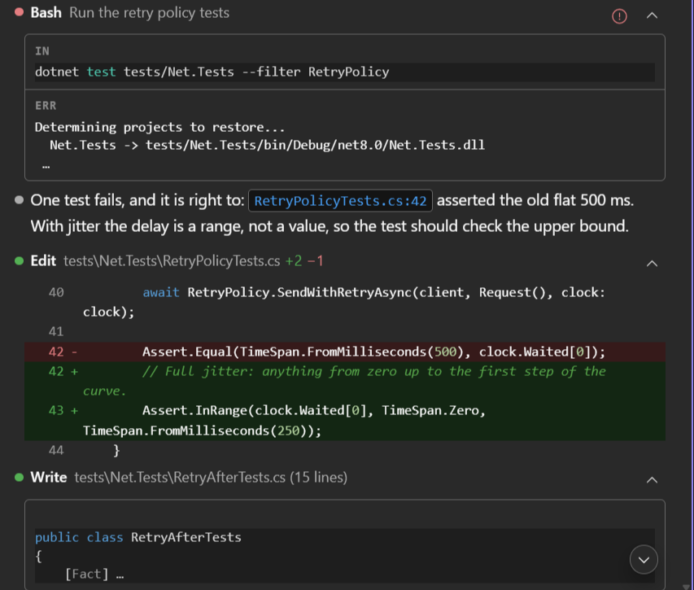
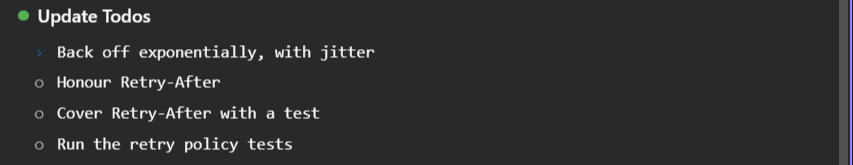
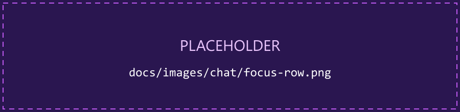
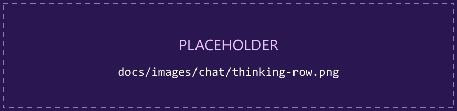

What the transcript shows, and how much of it.

## Your messages

A long message is clipped to **Preview lines**, with **Show more** / **Show less**. Hovering a
message of yours gives **Copy message**, **Fork conversation from here** (see
[Sessions](/cv4vs-agents/chat/sessions/#fork)) and how long ago it was sent.

Chips on the bubble show what went with it: the editor file and lines, images, attached files.
Clicking the file chip opens it at those lines; an image opens the lightbox, which has **Copy
image**.

A message still waiting in the queue is shown dimmed. A turn you stopped leaves a *[Request
interrupted…]* line, marked in orange.

## Tool rows

Collapsible rows, one per tool call. An open row has an **IN** and an **OUT** cell (**ERR** on a
failure), each with a copy button; clicking a cell opens its full text in a Visual Studio document.
Clicking a file path opens the file in VS.

- **Read** shows its line range and opens the file there.
- **Edit** shows an inline diff; on opening the file the selection lands on the lines that changed,
  taken from the patch the CLI itself computed, so it is right even after the edit has been applied
  and the file touched again (**Select lines when opening file**). Its title carries the counts
  (`+3 −14`), or `Edit failed`.
- **Write** shows the content itself, with the line count in the title: see
  [Reviewing changes](/cv4vs-agents/chat/diff/).
- **Bash** and **PowerShell** commands are never clipped and are highlighted; their output stays a
  preview even with the row open, the full text being one click away.
- **Grep**, **Glob** and **WebSearch** show a count (`12 matches`, `No files`) that opens the full
  result.
- **MCP tools** read `MCP Tool` then `server · tool`, with input and output as indented,
  highlighted JSON, never clipped.
- **Agent** rows group a sub-agent's own tool calls: see [Sub-agents](/cv4vs-agents/chat/sub-agents/).

A failed row has a **Show error details** button; with **Show tool errors inline** on, the error is
shown under the output instead. A row left unfinished in a reopened session is shown as failed.

## View mode

How much of the work the transcript shows, from the **View mode** slider in the `/` menu.

| Mode | Command | Shows |
|---|---|---|
| **Full** | `/vm:full` or `/vm:0` | every row |
| **Focus** | `/vm:focus` or `/vm:1` | every reply; each run of tool calls and thinking between two of them folds into one row (`5 tool calls · 1 failed`, `Running Bash…` while it works) that opens in place |
| **Hide tools** | `/vm:hide` or `/vm:2` | the tool rows are dropped altogether; thinking rows stay |

The commands set a mode outright, without leaving the keyboard: type `/vm:1` and press Enter. The
number is how much is hidden, 0 nothing and 2 the most. They work with a draft in the composer too:
a `/` that starts a word opens the menu anywhere in the text, and what you typed for the command
is removed once it has run. `/view`, `/hide` or `/tools` bring the slider itself to the top of the
list. The mode is shared by every open chat.

Kept in every mode: your answers to questions, plan decisions, the task list, and a call waiting
for your approval.

 A fold opened while its run was still working closes again when the turn ends.

## Diffs

Edit rows show a diff with the file's own line numbers and the context around each change,
syntax-highlighted, with the changed words marked inside an edited line. Clicking it opens the
change in Visual Studio's native side-by-side diff. See
[Reviewing changes](/cv4vs-agents/chat/diff/).

## Thinking

With **Thinking** on, the model's reasoning appears as a closed row above the answer: *Thinking…
12s* while it runs, *Thought for 12s · ~88 tok* afterwards. Open it to read the reasoning.

## Compaction

When the CLI compacts the conversation the spinner reads *Compacting…*, and the transcript gains a
separator: *Compacted chat · auto · 84k tok freed*. Open it to read the summary that replaced the
earlier messages, fetched when first opened. A compaction that fails leaves a red *Compaction
failed: …* line.

## Markdown and copy

- **Full Markdown rendering**: tables, lists, blockquotes, links, and fenced code blocks rendered
  with **syntax highlighting** (highlight.js) across all common languages.
- **Everything is copyable**: a copy button on every message, tool row, code block and table, so
  any part of the conversation can be lifted out. A table copies as markdown, pipes and alignment
  included, so it parses back as the same table wherever you paste it.
- **Clickable file references**: `ClientEvents.cs:208` in an answer is a link that opens the file;
  see [Clickable file references](/cv4vs-agents/chat/file-links/).
- **Image lightbox** and a **welcome screen** for empty chats.

## Cost and elapsed time

The spinner counts the seconds while the turn runs, and the output tokens received so far (`↓ 1.2k
tok`, an estimate).

With **Show cost and duration** on, the row of actions that appears when you hover a finished
answer also carries what the turn cost: `$0.3260 · ↑ 1.2k ↓ 84 tok · 3.2s` (cost, input and output
tokens, time). A turn read back from history shows its tokens only: cost and duration are not
stored in the session file.

An Agent row carries a running clock while its sub-agent works and, once it has finished, the run's
own totals (`1m 23s · 12k tok · 8 tools`), whatever the option says.

## Notices

There are two places: session notices at the top of the chat, turn notices above the prompt. Each
shows at most three; information and success fade after 7 seconds, warnings and errors stay until
you dismiss them.

- A turn that ends without an answer says why: *Turn limit reached*, *Budget limit reached*, *Usage
  limit reached*, *Prompt too long*, *Stopped by a hook*, *API error*, *Model error*. A turn you
  stopped yourself shows none.
- If the CLI process exits: *Claude Code process exited (code N)*, with a **View logs** button. It
  clears when the CLI starts again, which your next message does. See
  [Troubleshooting](/cv4vs-agents/troubleshooting/#the-cli-process-exited).
- A file that will not open says so, with the reason.
- Rate-limit notices are in [Context, usage & statistics](/cv4vs-agents/chat/context-and-usage/#rate-limit-notices).

## Read a response aloud

A speaker button on each answer reads it out with the system voice (Web Speech, no extra install);
click to pause, click to resume. The markdown is spoken as plain prose: no "asterisk asterisk", no
code blocks recited. One reading at a time: starting another stops the first.

## Code review findings as a list

`/code-review` reports its findings as a readable list: severity first, each with its file and line
as a link that opens there, instead of the raw call data. The row grows to fit them, so nothing
hides behind an inner scrollbar; after a `--fix` run it also says what each finding became.

## Long sessions

- **Lazy history**: the transcript is read from the `.jsonl` on demand: the newest page (batch of
  50) first, older pages only as you scroll up, and heavy blocks (images, sub-agent transcripts,
  full diffs) fetched only when opened. Nothing is held in memory up front: long sessions open fast
  and stay light.
- **Jump to the latest**: scrolling up puts a button in the corner that returns you to the bottom
  of the transcript.

## Related options

**Preview lines**, **Collapse tool results**, **View mode**, **Sticky user messages**, **Show tool
errors inline** and **Chat font size** are under [Options → Chat](/cv4vs-agents/options/#chat).
