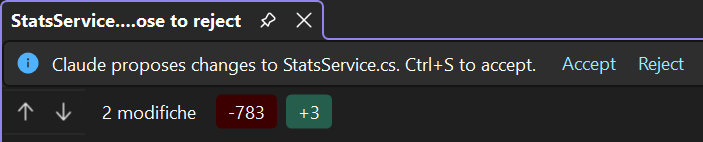

Every Edit the agent proposes shows up in the chat as an **inline diff**. You can read it there, or
open it in Visual Studio's own diff, with the full editor.

## Inline diff

Each Edit (and MultiEdit) tool row renders a preview of the diff: the added and removed lines with a few lines
of context around them, syntax-highlighted for the file's own language, and with the changed words
marked inside a line that was edited rather than rewritten. The row's title carries the counts:
`+3 −14`, the same numbers git would report.

The line numbers are the **file's**, not the fragment's, and come from the patch the CLI computes
when it applies the edit. While the tool is still running there is no patch yet: the preview shows
what is being changed without a line gutter, and gains the numbers once the edit lands.

Long lines wrap instead of scrolling sideways, so the preview reads in a docked tool window. A large change is cut short: the preview shows at most 12 rows, with 3 lines of context, then *… N
more lines*. Click it to see the whole thing in Visual Studio's own diff.

A **Write** creates or replaces a whole file, so there is nothing to compare: its row shows the
content itself, highlighted for the file's language, with the line count in the title (`Write Foo.cs
(42 lines)`). Clicking that content opens it in a Visual Studio document.

## Opening the file at the change

Clicking the path on an Edit row opens the file in Visual Studio with the **changed lines already
selected**, not the whole hunk: the context lines a patch carries either side are left out, so the
selection is what the agent actually wrote.

The range comes from the same patch the preview renders (the one the CLI produces when it applies
the edit), so the jump and the diff can never disagree about where a change is. Nothing is searched
for in the file, so it still lands correctly after the edit has been applied (the usual case) and
after later edits have moved the lines. A `Write` creating a new file has no patch and simply opens
it, as does a tool still running; a `MultiEdit` selects the first change.

Turn it off with **Select lines when opening file** (**Options → Chat**) to just open the file.

## Open in Visual Studio

Clicking the preview of an Edit opens the change in Visual Studio's native side-by-side diff, in a
tab named `Claude Code: <file>`: **Original** on the left, **Proposed** on the right. It compares
the text the edit replaces with the text it puts there, with the editor's own colouring and
navigation. Clicking the same row again closes it; opening another change replaces it, so the chat
never leaves a trail of diff tabs behind.

This view is for reading. In a Chat pane the change is approved or refused in the conversation,
with the approval prompt (see [Permissions](/cv4vs-agents/chat/permissions/#approving-a-tool)):
saving or closing the diff tab decides nothing, and the tab closes by itself once you answer.

## The editable diff

Visual Studio has a second diff, and that one does decide. The
[`editor_open_diff`](/cv4vs-agents/mcp-tools/#editor) tool opens the **whole file** against a
proposed version of it, in a tab whose title ends in *Ctrl+S to apply · close to reject*, with an
**Accept** / **Reject** bar above the editor. The proposed side is a real editor: you can change it
before deciding.

| You | The tool answers |
|---|---|
| **Ctrl+S**, or **Accept** | `FILE_SAVED`, with the text as you saved it, your own changes included |
| close the tab, or **Reject** | rejected |

The call waits until you decide. The tool does not write the file: it hands the saved text back to
whoever opened the diff, and that caller applies it.

In a Chat pane nothing opens this diff for an Edit waiting on your approval: the prompt is what
answers the CLI, and the diff you reach from the preview is the read-only one above. The agent can
open the editable one itself, when you ask it to show a change before making it ("show me the diff
first"): it then gets back what you saved and makes the edit from that.
