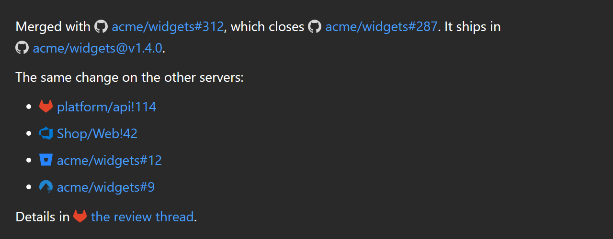

When Claude gives you the address of a pull request, an issue, a commit or a release, the chat
shows it the way that service itself writes it: short, with the service's mark in front, in that
service's colour.

`https://github.com/acme/widgets/pull/312` becomes `acme/widgets#312`. The link is the same one:
only the text changes, and a click still opens the page in your browser.

It matters most when a project lives in more than one place. A solution with its main repository
on a GitLab server and a GitHub repository as a submodule gets links to both in the same answer,
and the mark tells them apart at a glance.

## What you see

| Claude writes | You see |
|---|---|
| `https://github.com/acme/widgets/pull/312` | `acme/widgets#312` |
| `https://github.com/acme/widgets/issues/287` | `acme/widgets#287` |
| `https://github.com/acme/widgets/commit/5269a59…` | `acme/widgets@5269a59` |
| `https://github.com/acme/widgets/releases/tag/v1.4.0` | `acme/widgets@v1.4.0` |
| `https://github.com/acme/widgets/actions/runs/37756008986` | `acme/widgets run 37756008986` |
| `https://gitlab.example.com/platform/api/-/merge_requests/114` | `platform/api!114` |
| `https://gitlab.example.com/platform/api/-/work_items/1402` | `platform/api#1402` |
| `https://gitlab.example.com/platform/api/-/pipelines/494` | `platform/api pipeline 494` |
| `https://dev.azure.com/acme/Shop/_git/Web/pullrequest/42` | `Shop/Web!42` |
| `https://dev.azure.com/acme/Shop/_workitems/edit/1402` | `Shop#1402` |
| `https://bitbucket.org/acme/widgets/pull-requests/12` | `acme/widgets#12` |
| `https://codeberg.org/acme/widgets/pulls/9` | `acme/widgets#9` |

The notation is each service's own, not one of ours: GitLab and Azure DevOps write `!` for a
merge or pull request and `#` for an issue or a work item, GitHub writes `#` for both. Whatever
follows the number in the address (`/files`, `#issuecomment-…`, `?…`) does not change the
reference.

## The address is always one hover away

A short reference hides where the link goes, so the **full address is the tooltip** of every link
shown this way. Point at it before you click.

A link Claude gave a name of its own, such as `[the review thread](https://…/merge_requests/114)`,
**keeps that name**. It only gains the mark and the tooltip.

## Which services, and how they are recognised

There is no shared standard for these addresses, so each service has its own rule.

| Service | Recognised by |
|---|---|
| GitHub | the name `github.com` |
| GitLab, on gitlab.com or on your own server | the `/-/` every such address carries |
| Azure DevOps, cloud or Server | `/_git/…/pullrequest/` and `/_workitems/edit/` |
| Bitbucket Cloud | the name `bitbucket.org` |
| Bitbucket Data Center | `/projects/KEY/repos/…/pull-requests/` |
| Codeberg, Gitee, Gitea | the names `codeberg.org`, `gitee.com`, `gitea.com` |
| Gitea and Forgejo on your own server | `/pulls/` followed by a number |
| Gerrit | `/c/project/+/` followed by a number |

A server of your own needs **no configuration**: GitLab, Azure DevOps Server, Bitbucket Data
Center, Gitea and Forgejo are recognised by the shape of the address, whatever the server is called.

Gerrit, and Gitea or Forgejo on a server of their own, take the plain Git mark: the address says
which family the server belongs to, not which product it runs.

## What is left alone

- **An address whose shape does not name its service.** `/issues/12` and `/pull/3` exist on many
  kinds of site, so on a server the chat does not know they stay as they were written. A wrong
  label on a link is worse than a long one. This is why GitHub Enterprise on a server of your own
  is not recognised.
- **Links to anything else**: a repository's home, a file, a list of pull requests.
- **A number on its own.** `PR #312` written without an address is plain text: the number alone
  does not say which repository it belongs to.
- **Code blocks and inline code**, like every other link.

## Limits worth knowing

- The reference always carries the repository (`acme/widgets#312`), also when it is the one you
  have open.
- Nothing is fetched: no title, no state. The chat reads the address and nothing else, so it
  works offline and for private repositories.
- GitHub and GitLab were checked against real addresses. The other services follow the shape
  each one documents; if a link of yours is not recognised, or is shortened wrongly,
  [open an issue](https://github.com/Corsinvest/cv4vs-agents/issues) with the address.

## Not in the other tools

The Claude Code VS Code extension shows these links as the address Claude wrote, in full.

## See also

- [Clickable file references](/cv4vs-agents/chat/file-links/): `ClientEvents.cs:208` in an answer
  opens the file in Visual Studio.
- [The conversation](/cv4vs-agents/chat/conversation/): what the transcript shows, and how much.
