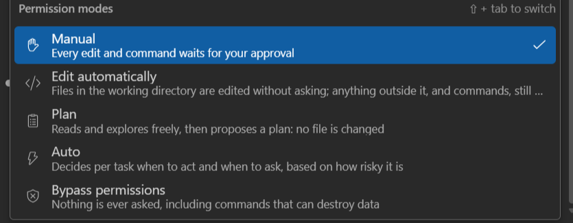
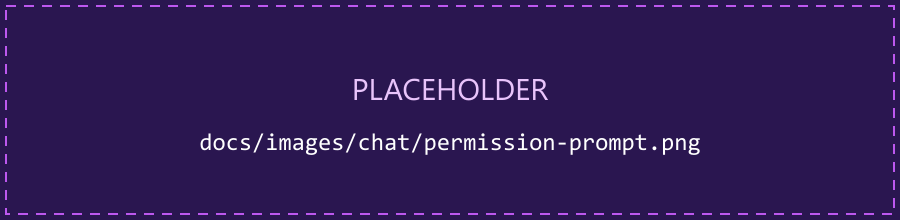
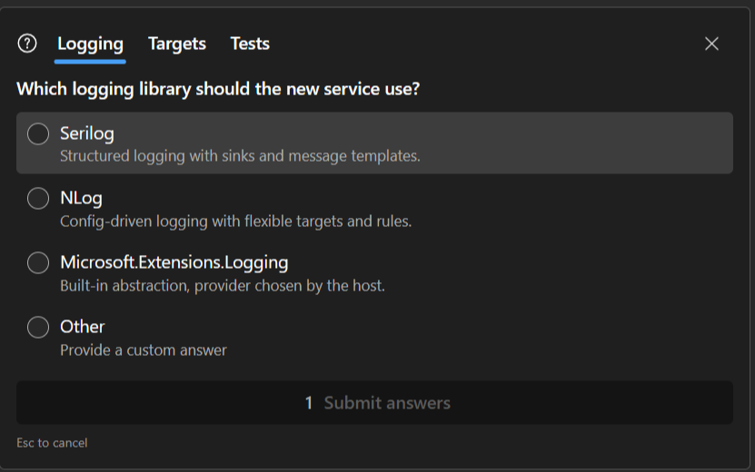
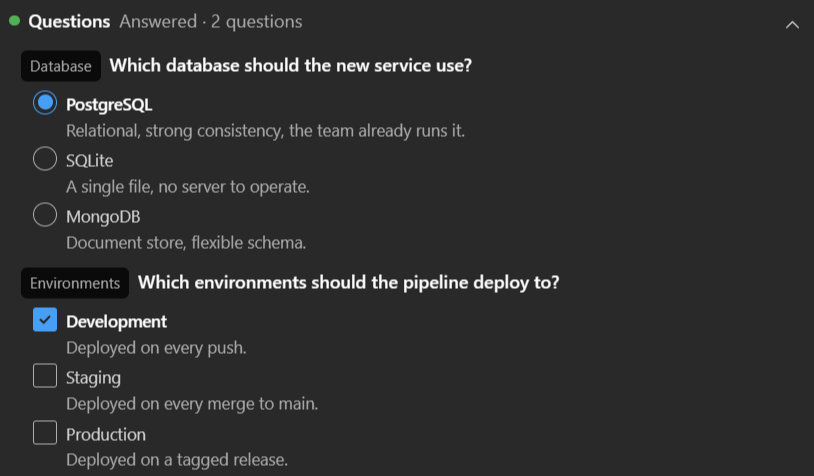

import { Aside } from '@astrojs/starlight/components';

What the agent may do without asking is the **permission mode**; what it asks, it asks in the
conversation.

## The modes

A selector in the composer toolbar. Shift+Tab cycles it through the modes on offer, and while the
composer has focus its border takes the mode's colour.

| Mode | On the button | What happens |
|---|---|---|
| **Manual** | Manual | Every edit and command waits for your approval |
| **Edit automatically** | Auto-edit | Files in the working directory are edited without asking; anything outside it, and commands, still ask |
| **Plan** | Plan | Reads and explores freely, then proposes a plan: no file is changed |
| **Auto** | Auto | Decides per task when to act and when to ask, based on how risky it is. Offered only when the current model supports it |
| **Bypass permissions** | Bypass | Nothing is ever asked, including commands that can destroy data |

The mode changes on the live process: switching it never restarts the CLI. It can also change
without you touching it: approving a plan sets the mode you chose to continue in.

**Initial permission mode** ([Options → Chat](/cv4vs-agents/options/#chat)) is the mode every new
chat starts in: `Default` (ask before edits), `AcceptEdits`, `Plan` or `BypassPermissions`. The
last one also requires **Allow dangerously skip permissions**: without it, sessions start in
Manual. A resumed session starts in the mode it was last in.

<Aside type="note" title="The IDE tools never ask">
The `mcp__vs__` tools are pre-approved in every mode: none of them raises this prompt. What the
agent should ask you before doing with Visual Studio is decided in your `CLAUDE.md`: see
[Teach the agent about the IDE](/cv4vs-agents/guides/teach-the-agent/).
</Aside>

## Approving a tool

When a tool needs your approval the prompt takes the composer's place until you answer; a draft you
were writing is kept. It names the tool and what it would touch:

| Key | Choice |
|---|---|
| 1 | **Yes**: this once |
| 2 | **Yes, allow …**: this once, and stop asking. For an edit it reads *Yes, allow all edits this session*; for a command it names a rule and where it is saved, and that last word can be clicked to change it |
| 3 | **No** |

Enter confirms the highlighted choice (Yes to begin with), ↑/↓ move between them, Esc answers No.

**Or type what to do instead…** refuses the tool and sends what you typed as the reason, so Claude
reads an instruction rather than a bare no.

A shell command is shown in a box you can edit: what runs is what the box holds when you say Yes.

With several panes open, the one waiting on a permission raises a VS InfoBar, and an OS
notification when you're outside Visual Studio; see
[Several panes at once](/cv4vs-agents/guides/several-panes/).

An Edit can also be opened in Visual Studio's own diff while the prompt is up, to read it with the
full editor; the answer is still given in the prompt. To change a proposal before it lands, ask the
agent to show it in the editable diff first: there **Ctrl+S** hands back what you saved. See
[Reviewing changes](/cv4vs-agents/chat/diff/#the-editable-diff).

## Answering a question

`AskUserQuestion` is answered in the conversation. The answer can be **structured**: several
questions in one panel, one tab each, single- or multi-select, with an **Other** choice that takes
your own text. A single-select answer moves to the next question by itself; **Submit answers** is
enabled once every question has one. Esc, or the cross, cancels.

Once answered, the row stays in the conversation as **Question**, with every option listed and
your pick ticked. It folds like any other tool row: the chevron closes it down to its header,
which still says whether it was **Answered** or **Declined**.

## Reviewing a plan

A long plan doesn't have to be read through the prompt's small scrolling box: the icon at its top
right, **Open in editor**, shows it as a normal document in VS's Markdown editor, full-size. While it is still waiting on your
answer you can change it there and save; the banner picks the change up (*Edited in the editor:
this version is what gets approved*), and approving sends what *you* wrote, not what was proposed.

The prompt asks which mode to continue in, not whether to run something:

| Key | Choice | Continues in |
|---|---|---|
| 1 | **Yes, and auto-accept** | Edit automatically |
| 2 | **Yes, and manually approve edits** | Manual |
| 3 | **No, keep planning** | Plan |

The text field sends Claude what to change instead. After you answer, the row in the conversation
keeps the decision and a button that reopens that plan, read-only.

## Bypass

<Aside type="danger">
**Bypass permissions** runs everything without asking, dangerous commands included.
</Aside>

It only appears at all if **Allow dangerously skip permissions**
([Options → Chat](/cv4vs-agents/options/#chat)) is on. It is off by default, and takes effect on new
sessions: the CLI decides at launch whether the mode can ever be entered. Enabling it does not skip
anything by itself: the mode still has to be selected. An organization policy can withhold it
whatever the option says.

When it is the active mode it is named in red on the toolbar whether or not the composer has focus:
it is the one worth noticing when you come back to a pane and don't remember how you left it.
