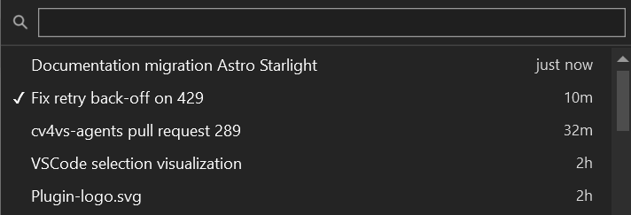

## One store, shared

No separate database: the extension reads and writes the CLI's own session store, so a conversation
started in the VS Code extension or in a terminal shows up here, and vice versa. Resume, fork and
rename all work on those shared files, so you can switch editor mid-project without losing context.

Where those files are is in [Settings and data](/cv4vs-agents/settings-and-data/).

## The session list

**Session History**, on the pane's toolbar: list, select-to-resume, inline **rename**, **delete**
(with confirmation).

A search box filters by title as you type; Enter opens the first match, ↓ moves into the list, Esc
closes. The session the pane is on carries a ✓. Each row shows how long ago it was used (`just
now`, `12m`, `3h`, `5d`, then the date); the tooltip has the full id and timestamp.

A session is listed under a title chosen in this order: your rename, the AI-generated title, the
last prompt, cut to 60 characters on one line. Sessions in which no prompt was ever sent, and
sub-agent transcripts, are left out.

**Delete** asks first (*Delete session "…"? This cannot be undone.*) and removes the transcript
only. The session's file backups stay, and show up in
[File history](/cv4vs-agents/documents/file-history/) under *Sessions no longer on disk*.

The list is always read fresh from the `.jsonl` files on disk each time you open it, with no cached
index that can go stale, so a session started or renamed elsewhere (VS Code, the CLI) shows up
immediately. It stays fast by reading files in parallel with head+tail 64 KB windows, never loading
whole files.

Sessions get **AI-generated titles**: asked of the live CLI once, after the first exchange, and
written only if the session has no title yet. **New Session** starts a fresh conversation in the
same pane; the **New Instance** split button opens a new pane, Chat or CLI: which is the default is
**Default new session** under
[Options → General](/cv4vs-agents/options/#general).

## Fork

Hover a message of yours and choose **Fork conversation from here**. A new pane opens on a new
session holding everything *before* that message, with the message itself waiting in the composer,
ready to be changed and sent. The original is left alone.

To put the *files* back without leaving the conversation, see
[Rewinding files](/cv4vs-agents/chat/rewind/).

## Session info

**Info**, in the pane's More (…) menu: the session's title, id and `.jsonl` path, the working directory and
profile, and which `claude.exe` is running it (path, version and PID). Chat panes add what the page
currently weighs. A **Copy** button puts the whole report on the clipboard, for a bug report.

The first thing to open when something is running against the wrong session, the wrong folder, or
the wrong CLI.

## Restoring panes with the solution

**Restore panes on solution open** (opt-in) reopens the panes you had open for a solution, each on
its own session and profile. See [Several panes at once](/cv4vs-agents/guides/several-panes/).
