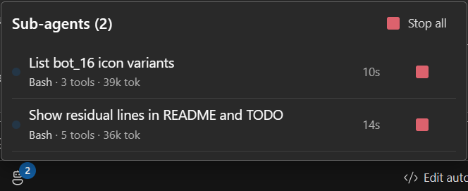
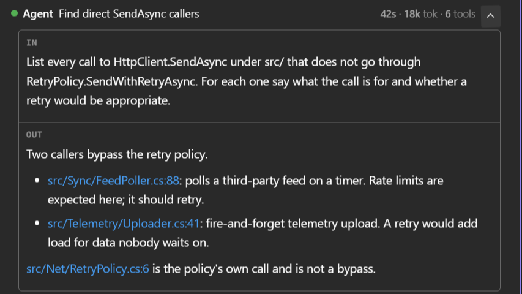

Claude can fan work out to **sub-agents**: separate agents it spawns to handle a piece of the task
in parallel (searching a large codebase, running independent checks, reviewing several files at
once). They run on their own, report back, and the main turn continues.

That is powerful and easy to lose track of: several agents can be running at once, each burning
tokens, and a chat that simply streamed everything would drown you. The extension surfaces them in
two places: a **live panel** while they run, and **collapsible rows** in the conversation.

## While they run: the composer chip

As soon as a sub-agent starts, a chip appears in the composer toolbar: a bot icon with a **badge
counting the active sub-agents**. It is only there while something is running: no sub-agents, no
chip.

Clicking it opens the sub-agents panel:

Each row shows:

| | |
|---|---|
| A live dot | the agent is running |
| Description | what it was asked to do |
| Current tool · totals | the tool it is using right now, then tool count and tokens spent |
| Elapsed | how long it has been running |
| Run in the background | lets the main turn finish without waiting for this agent; it moves under **Background** and keeps running |
| Stop | ends that agent |

Plus **Stop all** in the header, which stops every one of them. Agents launched by another agent
are indented under it.

The current tool matters more than it looks: with several near-identical agents ("Run build
simulation loop", "Run scan simulation loop") it is often the only thing that tells them apart.

Background and async sub-agents are tracked too: the turn is reported as *finished* only once they
have actually finished, not when the main reply ends.

## In the conversation: nested rows

The Agent row starts closed: its title, a running clock and the chevron. Open it and you get the
prompt the sub-agent was given (**IN**), its report once it has one (**OUT**), and its own tool
calls nested underneath, populated as they happen. The box shows the **last 3** steps; a `…` line
above them says there are earlier ones.

**Show all**, in the row's header, loads the whole run, every step in order. **Reduce** goes back
to the last 3. A button under the nested rows copies the sub-agent's output.

This is the same lazy rule the rest of the chat follows: nothing heavy is loaded until you ask for
it. A sub-agent that ran for two hundred steps costs nothing to scroll past, and shows everything
the moment you ask.

Sub-agent transcripts are replayed in history too, so re-opening an old session shows the same
nested structure; again, fetched only when you ask. A sub-agent that failed turns its Agent row
red; one you stopped does not.

## Stopping them

Two ways, both from the panel:

- **Stop** on a row: that agent only. The others carry on.
- **Stop all**: every running sub-agent.

There is no confirmation: stopping is immediate. A stopped sub-agent reports back as cancelled and
the main turn continues with what it has.
