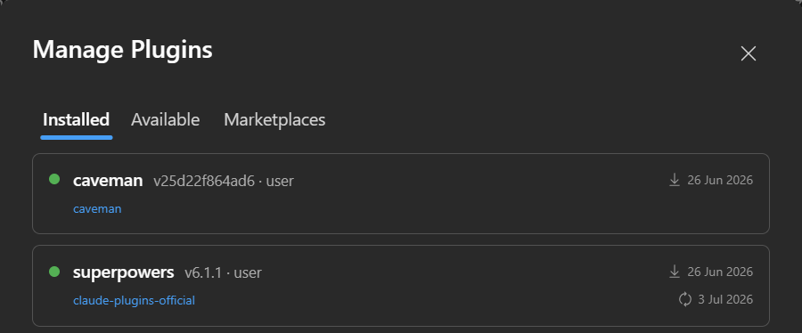
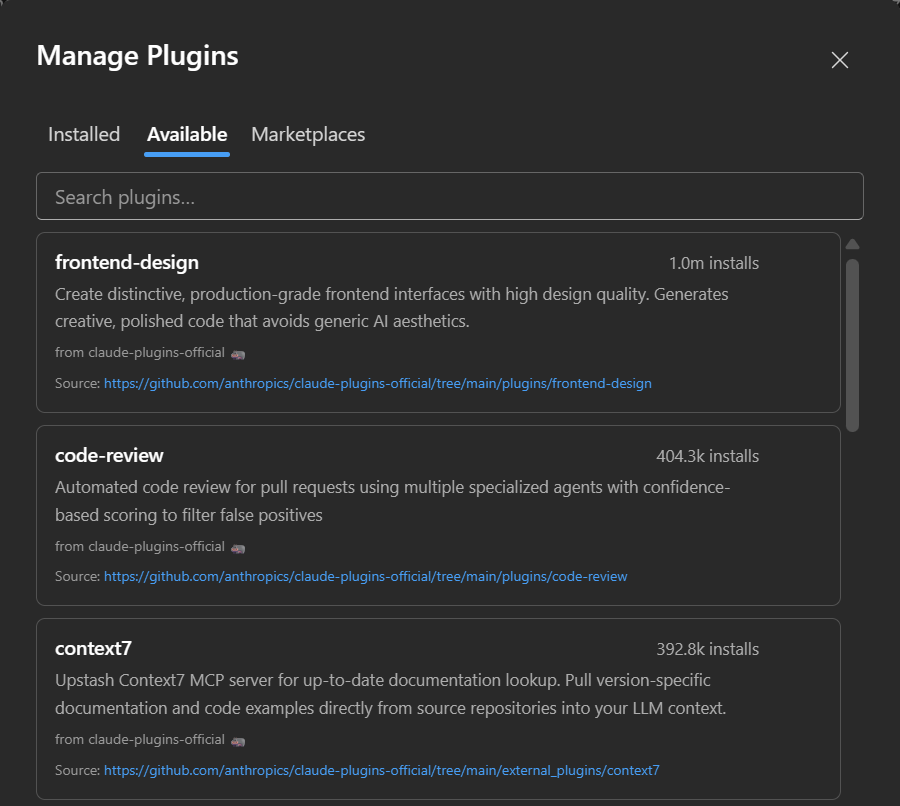
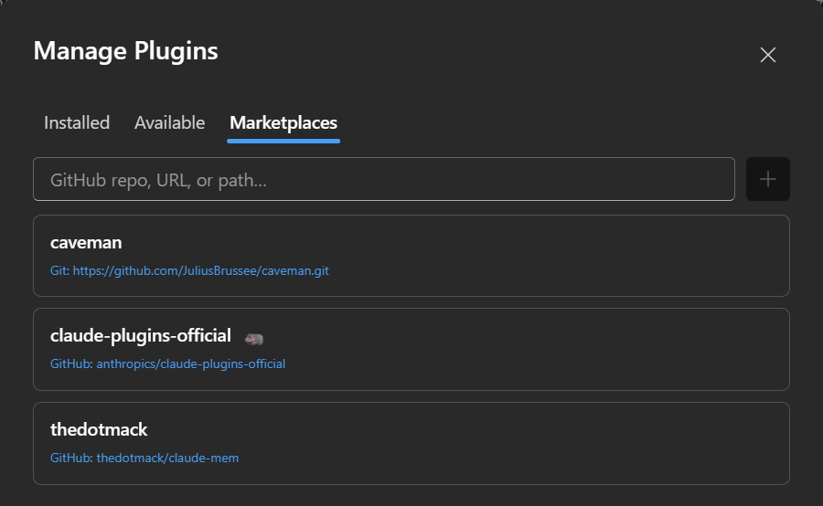

Manage Claude Code plugins without leaving the chat: install from a marketplace, enable or disable
what you have, and add marketplaces. Open it from the `/` menu: **Customize → Manage
plugins** (typing `/plugins` finds it).

Three tabs: **Installed**, **Available**, **Marketplaces**.

Plugin operations run as one-shot `claude plugin … --json` processes (the live chat process rejects
them). The result of each one is shown in a bar at the top of the dialog, in the CLI's own words. A
change to the active plugins reaches a chat when its CLI process next starts: open a new chat, or
resume the session, to pick it up.

## Installed

Everything currently installed, enabled ones first, each with its marketplace, version and scope
(`v1.2.0 · user`) and its install and update dates. Hovering a row swaps the dates for the
enable/disable toggle, **Update** and **Uninstall**. Turn a
plugin off to keep it installed but inactive; on to bring it back. Its skills, agents and MCP servers
follow the toggle.

**Update** (↻, on hover) installs the latest version the plugin's marketplace offers. The CLI refreshes
that marketplace first, so there is no need to refresh it by hand. When the plugin is already at the
latest version the message says so, and nothing needs a reload. Plugins synced from your claude.ai
account have no marketplace behind them and no Update button; manage them on claude.ai.

## Available

Everything on offer across your marketplaces, with an install count. A **Search plugins…** box filters by name and
description; the list is sorted by install count and shows the first 30 matches, so search to reach
the rest. Install straight from here (installs go to the user scope); the plugin then shows up under
**Installed**. Where a plugin's source can be browsed, a **Source** link under its description opens
it.

## Marketplaces

The marketplaces feeding the **Available** list. **Add** one by its source (a GitHub `owner/repo`, a git URL or a local
path), and **refresh** a marketplace to pull its latest catalogue; the ↻ spins while it fetches.
Removing a marketplace drops the plugins it offered from **Available** (already-installed ones stay).

## How it works

Nothing runs against the live chat process: plugin changes go through short-lived `claude plugin`
invocations, so they can't disturb an in-flight turn. Because plugins live in the CLI's own store,
what you install here is the same set the CLI, the VS Code extension and the terminal see.
