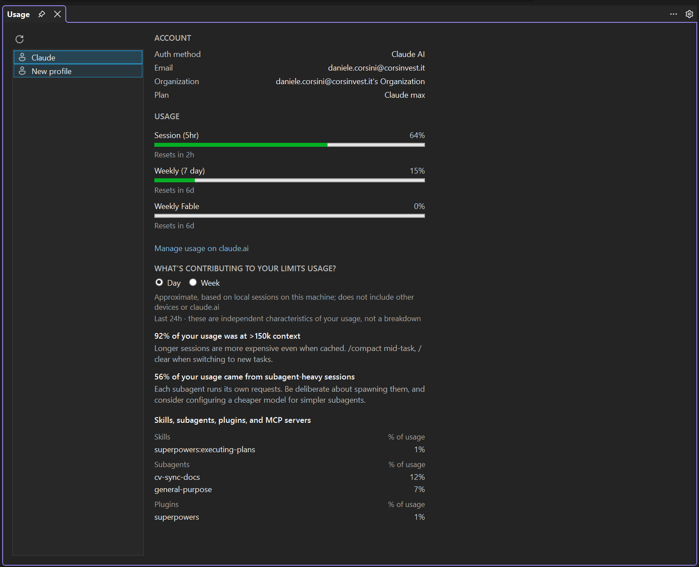
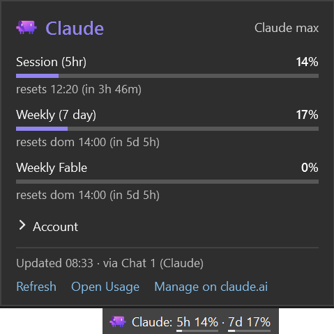

A full-window view under **View → cv4vs Agents → Analytics → Usage**: the live plan / rate-limit picture for
each profile, read from the CLI. It opens as a document-tab in the editor area, next to
[Statistics](/cv4vs-agents/documents/statistics/).

A profile list on the left; pick one and its **live** usage loads on the right, fetched from the CLI
for that profile (a short-lived process), so it reflects the real account, not something computed
here. **Refresh** re-fetches.

- **Account**: auth method, email, organization, plan.
- **Usage**: the plan's rate-limit windows (5-hour, 7-day, and per-model weeklies where they apply)
  as bars with utilisation and when each resets.
- **What's contributing to your limits usage?**: a Day / Week toggle over the CLI's own behaviour
  insights (e.g. how much came from subagent-heavy sessions or long context) and a per-category
  breakdown (skills, subagents, plugins, MCP servers).

The insights carry the CLI's own caveat: *Approximate, based on local sessions on this machine;
does not include other devices or claude.ai*.

The first profile is fetched when the tab opens; switching back to the tab does not fetch again.
When the CLI cannot answer the page reads *Usage unavailable for this profile.*

The "Manage usage on claude.ai" link is shown only for the first-party Claude AI account; third-party
providers (z.ai/GLM, Bedrock, Vertex, gateway) don't get it: the link wouldn't apply.

## Status bar

The same numbers without opening anything: an item at the right of Visual Studio's status bar, beside
the notification bell.

`Claude: 5h 44% · 7d 10%`: the session (5-hour) and weekly (7-day) windows, each with a thin bar
under it. A bar turns amber at 75% and red at 90%, or sooner when the CLI itself flags the window.
The tooltip lists every window with its reset time.

Click it for a popup with every window (per-model weeklies included) and when each resets, the
account (collapsed, so an email isn't on screen every time it opens), when the numbers were fetched,
and links to **Refresh**, this **Usage** tab and **claude.ai**. Esc or a click elsewhere closes it.

**Whose usage.** The profile of the Chat or CLI pane you last worked in, or the native **Claude** profile
until you have used one. A profile that sets `ANTHROPIC_API_KEY`, `ANTHROPIC_AUTH_TOKEN`, `ANTHROPIC_BASE_URL`,
`CLAUDE_CODE_USE_BEDROCK` or `CLAUDE_CODE_USE_VERTEX` has no plan limits, so it is never asked: the
item shows the icon alone, dimmed, with *No plan limits for this profile* in the tooltip (and the
profile name when several profiles are open).

The item **names that profile only when there is an ambiguity to resolve**: the open panes run more
than one profile, and none of them has the focus. The pane you are in already carries its profile in
its caption, so repeating it in the status bar spent room to say nothing; with every chat on one
profile, which is the usual case, the name is never shown. The tooltip and the popup name it either
way, so it stays a hover away.

**Where the numbers come from, and what that costs.** The CLI is the only source: nothing is read from
your credentials, nothing is estimated here:

- A **chat pane** on that profile answers from its own running `claude.exe`: after each turn (two
  seconds after it ends, at most once a minute per profile), whenever a rate-limit event arrives, and
  on the timed refresh below. No extra process.
- A profile with **no chat pane open** (only a CLI pane) has no process to ask, so a short-lived `claude.exe`
  (started without your MCP servers) fills in: when the numbers are older than *Status bar usage
  refresh (minutes)* (15 by default) while Visual Studio is in front, when the popup opens on numbers
  more than two minutes old, or on **Refresh**. Set the option to `0` and none is ever started in the
  background.

**It comes and goes with the panes.** With none open the item is not there (nothing is being spent,
so there is nothing to watch) and it returns with the first one. Close the only pane on the profile
being shown and it moves to one that still has a pane, rather than sitting on a session that ended.

**What the item can show.**

| What you see | Meaning |
|---|---|
| figures | as above; a window whose reset time has passed reads 0% until the next refresh |
| `-` | asking failed and there are no earlier numbers; tooltip *Usage unavailable* |
| icon only, dimmed | no plan limits for this profile, or the CLI was not found |
| dimmed figures | the last refresh failed; these are the previous numbers. The tooltip says when and why |

The tooltip ends with where the numbers came from: `Updated 17:40 · via Chat 2` or `· via
background`. After a failed refresh the next unrequested one waits 5 minutes; after an answer with
no plan, an hour. **Refresh** in the popup ignores both. The countdowns are redrawn once a minute.

Visual Studio has no API for a status bar item, so this one is placed in the bar's own layout. If
a future release changes that layout the item does not appear, and with the log level at `Warn` the
Output window says why.

*Show plan usage in the status bar* turns the item off altogether, see
[Options](/cv4vs-agents/options/#general).
