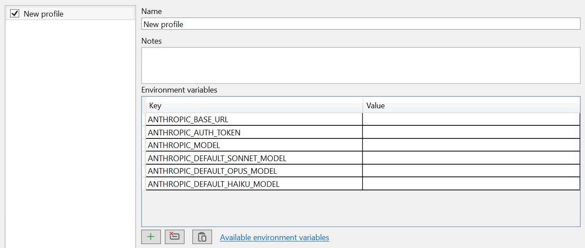

import { Aside } from '@astrojs/starlight/components';

Each pane can run on a different provider (native Claude, GLM/z.ai, or any other
Anthropic-compatible host) and the IDE tools work the same either way. What makes that possible is
a **profile**.

## What a profile is

A named set of environment variables (e.g. `ANTHROPIC_BASE_URL`, `ANTHROPIC_AUTH_TOKEN`, model
overrides) injected into that pane's `claude.exe`, so a pane can run on a different provider while
the IDE MCP tools keep working.

Profiles are edited under **Tools → Options → cv4vs Agents → Profiles**. It is not a settings table
but an editor:



Profiles are listed on the left (the checkbox enables one), and edited on the right: a name, optional notes, and the environment grid, pre-filled with the keys you are most likely to
need, so a new profile is usually just a matter of pasting two values. **Available environment
variables** links to Anthropic's reference for everything else the CLI understands.

Enabled profiles appear under **View → cv4vs Agents**, and the active one is shown in the pane
caption and toolbar.

A few rules:

- **Claude**, the native profile, is not stored: it is the process environment as it is. A profile
  of your own named `Claude` replaces it.
- Setting `CLAUDE_CONFIG_DIR` in a profile gives it its own config directory: separate login,
  settings, sessions, statistics and file backups. Profiles without it share `~/.claude`.
- A new pane opened from a pane's toolbar inherits that pane's profile.
- A profile with a blank name, or disabled, is ignored everywhere.
- A profile's variables are applied first and the extension's own last, so a profile cannot
  override `CLAUDE_CODE_ENTRYPOINT`.

## Paste from JSON

The editor's **Paste from JSON** button (the clipboard icon under the grid) fills the env grid from
the clipboard, so you can lift a
provider's snippet straight from its docs. It accepts either a full settings block:

```json
{ "env": { "ANTHROPIC_BASE_URL": "…", "ANTHROPIC_AUTH_TOKEN": "…" } }
```

or a plain key/value map:

```json
{ "ANTHROPIC_BASE_URL": "…", "ANTHROPIC_AUTH_TOKEN": "…" }
```

The `env` object is used when present, otherwise the whole object.

## Provider setup guides

- [z.ai / GLM](https://docs.z.ai/devpack/tool/claude): GLM, Kimi, DeepSeek, Qwen, MiniMax
- [Qwen](https://qwenlm.github.io/qwen-code-docs/en/users/configuration/model-providers/): DashScope Anthropic API
- [MiniMax](https://www.minimaxi.com/): Anthropic-compatible models
- [DeepSeek](https://api-docs.deepseek.com/guides/anthropic_api/): direct Anthropic API compatibility
- [OpenRouter](https://openrouter.ai/blog/tutorials/claude-code-openrouter/): multi-provider gateway
- [Ollama](https://docs.ollama.com/api/anthropic-compatibility): local open-source models
- [Complete alternative models guide](https://github.com/Alorse/cc-compatible-models): comprehensive provider list

## Without a profile

Profiles are not the only way: the CLI reads these variables from the process environment like any
shell would, so setting them **at the OS level** works too. Profiles are usually preferable: one
pane per provider, switchable without touching your system environment.

## What changes on another provider

<Aside type="caution" title="The IDE tools can go missing">
Pointing `ANTHROPIC_BASE_URL` at a custom host can disable the IDE MCP tools. That is a CLI-side
restriction, not something the extension controls.
</Aside>

- **Plan usage.** A profile that sets an API key, an auth token, a base URL, or the Bedrock or
  Vertex switch has no plan limits, so the
  [status bar item](/cv4vs-agents/documents/usage/#status-bar) shows the icon alone, dimmed.
- **Remote Control** isn't available on Amazon Bedrock, Google Vertex AI, or Microsoft Foundry, and
  not with a custom `ANTHROPIC_BASE_URL`: see
  [Remote Control](/cv4vs-agents/claude/remote-control/#requirements).
- **Statistics** show model names exactly as the API returned them, so a third-party provider's
  model ids stay readable.

## Where the token is stored

<Aside type="caution">
`profiles.json` holds the environment variables you enter in the Profiles page,
`ANTHROPIC_AUTH_TOKEN` among them. It is a plain file with no encryption, readable by anything
running as your user.
</Aside>

Unlike General, Chat and Debug, profiles are **not** stored in the VS settings store: they live in
`profiles.json` so the menu can list them without opening the Options page first; see
[Settings and data](/cv4vs-agents/settings-and-data/).
