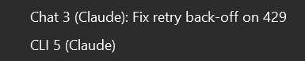

Open as many Chat panes and as many CLI panes as you like, side by side, each on its own
independent session, docking as tabs. Each pane is captioned with its kind, number and profile
(`Chat 3 (Claude)`), and its tab icon carries a chat or terminal glyph so a squeezed tab group still
tells them apart. This page is about living with more than one.

## Finding a pane

A toolbar list of every open pane, Chat and CLI together, each with its title and kind. Docked
panes hide each other behind tabs; this is how you find the one you want.

The same list is under **View → cv4vs Agents → Active sessions**; the entry is absent while no pane
is open.

## When a pane needs you

With several chat panes open (or Visual Studio in the background) you'd otherwise have no way to
know *which* pane needs you. The extension draws your attention **only when you're not already
looking at that pane**:

- **A pane needs input** (a blocking permission / `AskUserQuestion`): notified always: the model
  is waiting on you.
- **A turn finishes**: notified when you're elsewhere. Background/async sub-agents are handled
  correctly: the "finished" notice waits until the agents actually complete, not the moment the
  main turn returns.

How it reaches you depends on where you are:

| Where you are | What you get |
|---|---|
| Inside Visual Studio, on another pane or editor | a VS **InfoBar** on the main window (`Chat #N needs your input` / `Chat #N finished`) with a **Go to pane** action |
| Outside Visual Studio (another app, another monitor, a tiling window manager) | the same InfoBar, waiting for you when you come back, **plus** an OS notification titled *Claude Code*, layout-proof, so it shows regardless of how your windows are arranged. **Clicking it brings VS to the front and activates the right pane.** |
| Already on the pane (it's the active frame *and* VS has the OS focus) | nothing; you can see it |

The InfoBar or the notification lands your focus on the open ask (its first choice), not the hidden
textarea, so you can answer immediately. The notice goes away when you click into the pane, use
**Go to pane**, or the turn ends.

Only chat panes notify: a CLI pane is a terminal, and nothing tells the extension when it is
waiting.

:::note
The docked VS tab caption can't carry this state the way VS Code's editor title does (VS derives it
from the window name), which is why the extension uses an InfoBar + OS toast instead.
:::

## Panes follow the solution

A pane belongs to the folder it was opened in: its CLI runs there and cannot move.

- **Closing the solution** hides the panes after a second and closes them, ending their CLI
  processes, ten seconds later.
- **Reloading the solution** (Visual Studio closes and reopens it) keeps them: same folder, so the
  panes come back with their live process and the turn in flight.
- **Opening another solution** closes every pane whose folder differs, including those opened with
  no solution.
- **Starting or stopping the debugger** switches Visual Studio to another window layout, where
  panes opened earlier are missing: the extension shows them again. A pane you closed stays closed.

## Getting them back with the solution

**Restore panes on solution open** *(opt-in)* reopens the panes you had open for a solution, each on
its own session and profile, when you reopen that solution. Off by default: opening a solution
shouldn't start agents you didn't ask for.

State is saved per-solution; a removed profile falls back to native, a deleted session opens fresh.
Chat sessions restore exactly; CLI terminals resume via a session id the extension assigns up front
(so even a fresh terminal is tracked). The state is saved when the solution closes, whether or not
the option is on, so turning it on later still finds the last set. A disabled profile falls back to
native like a removed one, and a pane already open on a saved session is not opened twice.

The panes come back in saved order, but not at their exact dock position; see
[Known issues](/cv4vs-agents/known-issues/).

Turn it on under [Options → General](/cv4vs-agents/options/#general).

## A different provider in each

Each pane can run on its own profile, so one can be on Claude and the next on another provider. See
[Another provider](/cv4vs-agents/guides/another-provider/).
