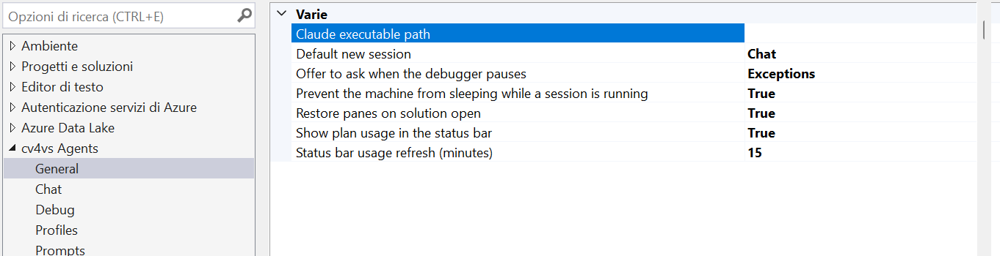
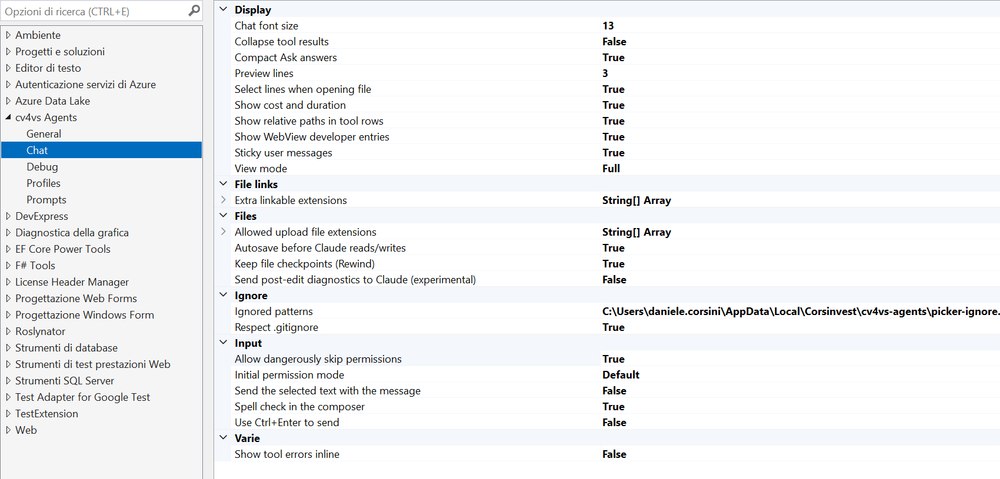
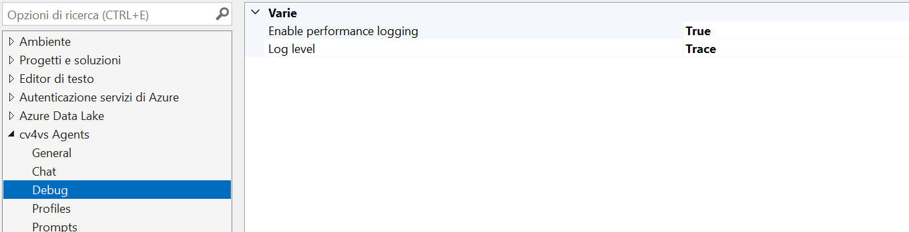

All settings live under **Tools → Options → cv4vs Agents**, split into five pages: **General**,
**Chat**, **Debug**, **Prompts** and **Profiles**.

Visual Studio persists them in its own settings store; profiles, per-solution state and caches
go to `%LOCALAPPDATA%`; see [Settings and data](/cv4vs-agents/settings-and-data/).

## General

| Setting | Type | Default | Description |
|---|---|---|---|
| Restore panes on solution open | bool | `false` | Reopen the panes (with their sessions) that were open for a solution when it is reopened. |
| Offer to ask when the debugger pauses | `Never` / `Exceptions` / `ExceptionsAndBreakpoints` | `Exceptions` | Show an InfoBar over the file the debugger stopped in, with an "Ask cv4vs Agents" link that asks a chat pane about the break. See [Asking about a break](#asking-about-a-break). |
| Default new session | `Chat` / `Cli` | `Chat` | Which kind of pane the "New" button creates, and which kind a profile under **View → cv4vs Agents** opens. The dropdown beside "New" still lets you pick the other. |
| Prevent the machine from sleeping while a session is running | bool | `true` | Keep Windows awake while a chat pane is working, so a turn is not suspended half-way through and left hung. The display still sleeps on its own timer, and an idle pane holds nothing. A CLI pane never holds: a terminal has no notion of a turn. See [Keeping the machine awake](/cv4vs-agents/power/). |
| Claude executable path | file path | *(empty)* | Override auto-detection with a specific `claude.exe` (browse with `…`). Empty = auto-detect via PATH / native installer / npm. Must be the real `.exe`: `.cmd`/`.bat`/`.ps1` shims can't be launched. A path that does not exist, or is not an `.exe`, is not an error: auto-detection takes over and a warning goes to the log. See [Troubleshooting](/cv4vs-agents/troubleshooting/#the-pane-says-the-cli-is-missing). |
| Show plan usage in the status bar | bool | `true` | The Claude plan's session (5h) and weekly (7d) usage in Visual Studio's status bar, for the profile of the pane you last used; click it for every limit and when each resets. Shown only while a pane is open: with none there is nothing being spent. See [Usage → Status bar](/cv4vs-agents/documents/usage/#status-bar). |
| Status bar usage refresh (minutes) | int | `15` | How often the status bar refreshes plan usage while the profile it shows has no chat pane open (a CLI pane only), by starting a short-lived `claude.exe`, only while Visual Studio is in front. `0` = never in the background: open chat panes, and opening the status bar popup, still refresh it. |

### Asking about a break

When the debugger stops, an InfoBar appears over the file it stopped in, with an **Ask cv4vs
Agents** link that asks a chat pane about the break. Exceptions raise it by default, the other pauses that are not a step are opt-in, steps never do. The whole story is in
[Debug with the agent](/cv4vs-agents/guides/debug-with-the-agent/).

## Chat

The page groups its settings in categories, in alphabetical order; the tables below follow them.

### Display

| Setting | Type | Default | Description |
|---|---|---|---|
| Show cost and duration | bool | `false` | Show cost (USD) and duration after each response. |
| Show relative paths in tool rows | bool | `true` | File paths relative to the working directory (full path if outside it). |
| Select lines when opening file | bool | `true` | When opening a file from a tool row, select the relevant lines in the editor. |
| Preview lines | int | `3` | Lines shown in preview areas (tool output, user messages) before a body is clipped. `0` shows an open row whole, however long it is. |
| Collapse tool results | bool | `false` | Start every tool row closed, so a long session reads as what Claude did rather than how it got there. The chevron opens one when you want it; a failed row still shows its dot and the button that opens the full output. |
| View mode | `Full` / `Focus` / `HideToolCalls` | `Full` | How much of Claude's work the chat shows. **Full**: every row. **Focus**: each run of tool calls and thinking between two replies folds into one row (`5 tool calls · 1 failed`, or `Running Bash…` while it works) that opens in place. **HideToolCalls**: the tool rows are removed. In every mode your answers to questions, plan decisions, the task list and a call waiting for your approval stay. The **View mode** entry in the chat's `/` menu switches it for every open chat, keeping each row as it was: open or closed, older history kept. Changed here instead, it reloads each idle chat like any other setting on this page. |
| Chat font size | int (px) | `13` | Font size of the conversation: messages, answers, tool rows and their code. |
| Show WebView developer entries | bool | `false` | Add "WebView DevTools" and "WebView task manager" to the chat toolbar's "More" (…) menu: the browser console/DOM/network on the chat itself, and the browser's processes with their memory and CPU. Pre-release builds always offer both. |
| Sticky user messages | bool | `true` | Pin the current exchange's user message at the top while the reply/tool rows scroll below. |

### File links

| Setting | Type | Default | Description |
|---|---|---|---|
| Extra linkable extensions | string[] | *(empty)* | Extensions to also linkify when Claude names a file **in prose** (`render.wgsl:20`), on top of the ~270 built-in ones, needed only for a language not shipped yet. A markdown link written by the model is always linked, whatever its extension. One per line, without the dot. See [Clickable file references](/cv4vs-agents/chat/file-links/). |

### Files

| Setting | Type | Default | Description |
|---|---|---|---|
| Autosave before Claude reads/writes | bool | `true` | Save a dirty file before Claude reads/writes it, so it sees your in-editor edits, not the stale on-disk version. |
| Keep file checkpoints (Rewind) | bool | `true` | Let Claude copy a file before editing it, so [`/rewind`](/cv4vs-agents/chat/rewind/) can restore it. Only files Claude edits are covered: what it changes by running a command is not. Copies live under `~/.claude/file-history` and are never cleaned up, the reason to turn this off if you do not use Rewind. Read when a chat starts, so it applies to the next one you open. |
| Send post-edit diagnostics to Claude (experimental) | bool | `false` | Feed back the new errors/warnings an edit introduced. Experimental: unreliable because VS only analyses files open in an editor (see [Editor context](/cv4vs-agents/ide-integration/#post-edit-diagnostics)). |
| Allowed upload file extensions | string[] | 100 defaults | Extensions accepted on upload/drop. Images (`.png`, `.jpg`, `.gif`, `.webp`) are sent as images, `.pdf` as a document, the rest as text. Video files are listed so they can be attached, but Claude cannot watch them and only sees the file name. Anything not listed is rejected with a notice. One entry per line, with or without the leading dot. |

### Ignore

| Setting | Type | Default | Description |
|---|---|---|---|
| Respect `.gitignore` | bool | `true` | Also hide from the `@` picker what the workspace's `.gitignore` files (at every level inside it, none above it) and git's global excludes (`core.excludesFile`) match, inside a git repository or not. Off: only the Ignored patterns below apply. |
| Ignored patterns | file path | shipped defaults | Extra rules hiding files from the `@` picker, written as a `.gitignore` and kept as one: the row shows where the file is and `…` opens it in the editor. Applied only where the workspace's own ignore rules say nothing, so they are the fallback for a project that ships none. The picker lists the whole workspace, with no limit on the number of files: the list is read when the `@` menu opens and filtered as you type. |

### Input

| Setting | Type | Default | Description |
|---|---|---|---|
| Send the selected text with the message | bool | `false` | Attach the selected code itself, not just its file and line numbers. Off, the message names the lines and Claude opens the file to read them: the same content, but only if it needs it, and only once. On, the code travels with **every** message sent with a selection. Turn it on when you ask about code you have not saved: off, Claude reads the file from disk and sees the saved version. The composer's context chip shows which of the two is going out (🔖 position / 🧾 position + code). See [Spending less context](/cv4vs-agents/guides/spending-less-context/). |
| Use Ctrl+Enter to send | bool | `false` | On: Ctrl+Enter sends, Enter = newline. Off: Enter sends, Shift+Enter = newline. |
| Spell check in the composer | bool | `false` | Underline misspelled words while you type. Off by default: code names, paths, `@` mentions and `/` commands are what the composer mostly holds, and the spell checker flags all of them. The underline marks the word; correcting it is up to you. |
| Initial permission mode | `Default` / `Manual` / `AcceptEdits` / `Plan` / `BypassPermissions` | `Default` | Mode every new chat starts in (changeable per-session from the toolbar). `Default` leaves it to Claude Code: the `permissions.defaultMode` of your `settings.json` (user or folder), or the mode it picks by itself when there is none (which may be Auto), as in a terminal. `Manual` always asks before edits, whatever `settings.json` says. `BypassPermissions` also requires **Allow dangerously skip permissions** below: without it, sessions start in Manual. |
| Allow dangerously skip permissions | bool | `false` | Adds "Bypass permissions" to the toolbar's permission menu: a mode that never asks, even for commands that can destroy data. Enabling it skips nothing by itself: the mode still has to be selected. Takes effect on new sessions. |

### Misc

The one setting with no category of its own; the page lists it last, under *Misc*.

| Setting | Type | Default | Description |
|---|---|---|---|
| Show tool errors inline | bool | `false` | Show the tool error inline below the diff/output; off = alert icon only (click to open in VS). |

## Debug

| Setting | Type | Default | Description |
|---|---|---|---|
| Log level | `None` / `Error` / `Warn` / `Info` / `Debug` / `Trace` | `None` | Output-window verbosity. `None` = silent; `Trace` = include bridge traffic. Lines are prefixed with the originating pane (`[chat#2]`, `[cli#1]`) so several open panes can be told apart in the single Output pane. |
| Enable performance logging | bool | `false` | Performance-span logging in the Output window (C#) and browser console (JS). Requires a VS restart. |

## Profiles

Not a settings table but an editor: each profile is a named set of environment variables (e.g.
`ANTHROPIC_BASE_URL`, `ANTHROPIC_AUTH_TOKEN`, model overrides) injected into that pane's
`claude.exe`, so a pane can run on a different provider while the IDE MCP tools keep working.

Profiles are not stored in the VS settings store: they live in `profiles.json`. Creating one, Paste
from JSON and the provider setup guides are in
[Another provider](/cv4vs-agents/guides/another-provider/).

## Prompts

Not a settings table but an editor: the entries offered under **cv4vs Agents** when you
right-click code, the Error List or the Output window: one tab per menu. Picking one writes it
into a chat pane's composer, or sends it when **Send on click** is set.

Like profiles, these live in a file, `prompts.json`. The columns, what each menu hands the prompt
and the fixed **Add to chat** entries are in
[Ask from the editor](/cv4vs-agents/guides/ask-from-the-editor/).
