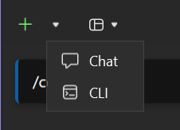
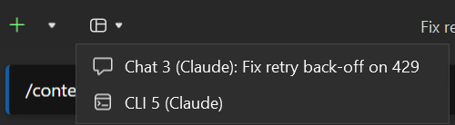
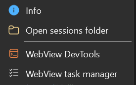

The extension registers **two dockable tool-window types**, both **multi-instance**: open as many
Chat panes **and** as many CLI panes as you like, side by side, each on its own independent session,
docking as tabs. Each pane is captioned with its kind,
number and profile (`Chat 3 (Claude)`), and its tab icon carries a chat or terminal glyph.

A pane's working directory is the solution's folder, or the opened folder, fixed when the pane
opens; with neither it is your home directory.

*The same conversation in both panes: the rich chat (inline diffs, tool rows, the editor file
attached to the prompt) and the real CLI. One session store: open it in either, or in VS Code.*

## The Chat pane

A rich WebView2 UI (TypeScript + Lit). It drives `claude.exe` in headless mode over the NDJSON
stream-json control protocol, and exposes the IDE to the CLI through an in-process MCP server.

It is the same CLI, started the same way, as behind Anthropic's VS Code extension: sessions,
commands, plugins and settings are shared with it. See
[Compared with the official VS Code extension](/cv4vs-agents/claude/vs-code-differences/).

What it adds on top of the CLI is in the **Chat** section of this site, starting from
[The composer](/cv4vs-agents/chat/composer/).

## The CLI pane

The interactive Claude Code CLI rendered with a real terminal (ConPTY), launching
`claude.exe --ide`. It reaches the same [IDE tools](/cv4vs-agents/mcp-tools/) over the WebSocket
MCP channel.

**Open Claude in Terminal**, in the chat's `/` menu, launches an interactive CLI session from a
chat.

- **It closes itself when `claude` exits** (`/exit`, Ctrl+C twice, a crash): the pane is only a view
  onto that process.
- **Keys go to the terminal.** While it has the focus, Esc and every Ctrl+letter reach the CLI
  rather than Visual Studio, so Ctrl+S or Ctrl+B there are the CLI's, not the IDE's.
- **New Session** and **Session History** restart the terminal on a fresh or a resumed session.
  There is no title box: the terminal does not report its session.
- The IDE tools are registered as an MCP server named `vs` and pre-approved, so calling them does
  not prompt.
- The font is Cascadia Mono 12; colours follow the Visual Studio theme.

## The pane toolbar

| Control | What it does |
|---|---|
| Title box (chat only) | the session's title; click to rename, Enter saves, Esc cancels. `Untitled` until the first exchange has produced one |
| **Open panes** | every open pane, Chat and CLI, by number, profile and session title |
| **New Instance** (split button) | a new **pane**, of the default kind or the one picked from the arrow, on this pane's profile |
| **Session History** | the session list for this folder |
| **New Session** | a fresh conversation in **this** pane |
| **More** | **Info**, **Open sessions folder** (the CLI's folder for this project in Explorer) and, on preview builds or with *Show WebView developer entries*, **WebView DevTools** and **WebView task manager** |

**New Session** and **Session History** are disabled until the pane's process is up.

## What changes without a restart

Model, permission mode and interrupt are **hot-swapped** on the live process: changing them never
kills the CLI. The process is replaced only when the conversation itself changes: **New
Session** in the same pane, or picking another session from **Session History**. A fork opens a new
pane and leaves this one's process alone. If the CLI has died, the next message starts it again on
the same session.

## A different provider per pane

Each pane can run on a different provider (native Claude, GLM/z.ai, or any other
Anthropic-compatible host) and the IDE tools work the same either way. See
[Another provider](/cv4vs-agents/guides/another-provider/).

## Lazy and fast

Nothing is built, read or started until you actually look at it. The chat holds **nothing in
memory**: the transcript is read from the session file on demand, newest page first, older pages
only as you scroll, and heavy blocks (images, sub-agent transcripts, full diffs) only when you open
them. Same for the rest: services, the MCP server and the panes themselves start on first use, not
on solution load. Long sessions and large solutions stay as light and quick as an empty one.

With several panes open, see [Several panes at once](/cv4vs-agents/guides/several-panes/).
