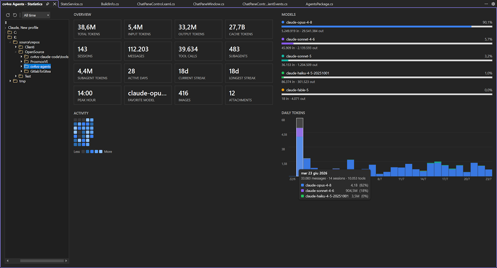

# Statistics

A full-window view under **View → cv4vs Agents → Statistics**: historical token usage, aggregated
**locally** from the CLI's session files, with a navigable tree on the left. It opens as a
document-tab in the editor area (not a dockable tool-window), so it gets the whole window for the
charts and tables. (For the live plan / rate-limit view, see [Usage](usage.md).)



### The tree (left)

The tree is the scope picker: click any node and the right side recomputes for exactly that node.
Every level is clickable.

```
All                         every profile, everything on disk
└─ Profile                  one config-dir (profiles sharing a ~/.claude collapse into one node)
   └─ Folder…               a folder in your path tree; aggregates every project beneath it
      └─ Project             one repository/working directory
         ├─ Days             that project split by calendar day
         │  └─ 22/07/2026    real tokens produced on that day
         └─ Sessions         that project's sessions, one file each
            └─ 14:32:07 …    one whole session (titled from the chat)
```

- **Folders are a real nested tree** built from each session's working directory, with single-child
  chains collapsed (`…\source\repos\Clienti` shows as one node until it branches) — like a solution
  explorer. Two projects with the same leaf name under different bases stay apart.
- **Days vs Sessions.** A **Day** counts the tokens actually produced *on that calendar day*, so a
  long chat that ran across several days contributes only that day's slice — it matches the chart. A
  **Session** counts the whole file (all its days). The two branches answer different questions:
  "how much did I spend on the 22nd?" vs "how much did this chat cost?".
- **Session titles** come from the session's own title (a rename, the AI-generated title, or the
  first prompt), read live — so a renamed session shows its new name without re-indexing.

The **Range** selector (7 days / 30 days / All time, next to the toolbar) filters the tree too:
out-of-range days, sessions, projects and folders are hidden, and the current selection is restored
on the rebuild — or falls back to **All** if it no longer exists in range.

### What you see on the right

For the selected node:

- **Overview** — summary tiles (total / input / output / cache tokens, sessions, messages, tool
  calls, active days, streaks, peak hour, favourite model, images, attachments, sub-agents) and a
  GitHub-style **activity heatmap**. Hovering a heatmap cell shows that day's messages, sessions,
  tools and per-model token split.
- **Models** — each model with its share and input/output tokens, and a **daily-tokens** stacked bar
  chart (one segment per model, coloured to match the model dots). Hovering a bar breaks that day
  down. The Y axis auto-scales to a clean 1/2/5 step at any magnitude (k / M / B).

Model names are shown **exactly as the API returned them** (`claude-opus-4-8`, not "Opus 4.8"), so a
third-party provider's model ids stay readable.

### Refresh vs Recreate

Two buttons on the tree toolbar:

- **Refresh** — an *incremental* re-index: only files whose modification time or size changed are
  re-read. Fast; run it to pick up sessions you just used.
- **Recreate** — a *full* re-index from scratch, ignoring the cache. Use it when files were moved
  between projects or a session's working directory changed, so the labels/grouping are rebuilt from
  the current on-disk state.

While either runs, the buttons give way to a progress indicator in the same spot; the tree and the
right side refresh when it finishes, keeping your selection.

### How it works

No telemetry, nothing uploaded. The numbers come from the `.jsonl` transcripts the CLI already
writes on your machine — the same files the chat history reads. Reading every file on every open
would be slow (hundreds of files, hundreds of MB), so each file's aggregate is cached in
`stats-cache.json`, keyed by its modification time and size: an unchanged file is never parsed
again. The first index shows progress; later opens are near-instant. Because the source is the
shared session store, statistics cover conversations started **anywhere** — this extension, the VS
Code extension, or the terminal.
