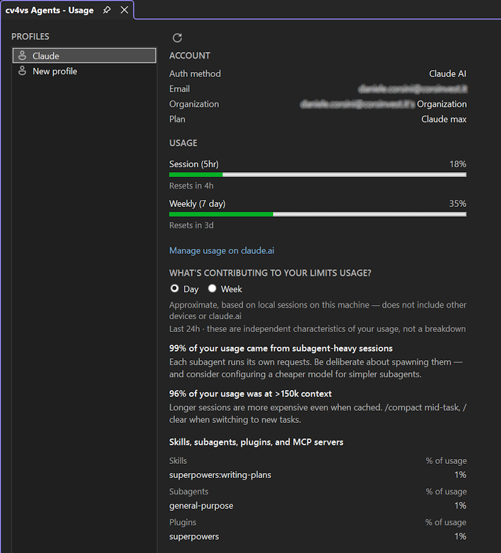

# Usage

A full-window view under **View → cv4vs Agents → Usage**: the live plan / rate-limit picture for
each profile, read from the CLI. It opens as a document-tab in the editor area, next to
[Statistics](statistics.md).

A profile list on the left; pick one and its **live** usage loads on the right — fetched from the CLI
for that profile (a short-lived process), so it reflects the real account, not something computed
here. **Refresh** re-fetches.

- **Account** — auth method, email, organization, plan.
- **Usage** — the plan's rate-limit windows (5-hour, 7-day, and per-model weeklies where they apply)
  as bars with utilisation and when each resets.
- **What's contributing to your limits usage?** — a Day / Week toggle over the CLI's own behaviour
  insights (e.g. how much came from subagent-heavy sessions or long context) and a per-category
  breakdown (skills, subagents, plugins, MCP servers).

The "Manage usage on claude.ai" link is shown only for the first-party Claude AI account; third-party
providers (z.ai/GLM, Bedrock, Vertex, gateway) don't get it — the link wouldn't apply.
