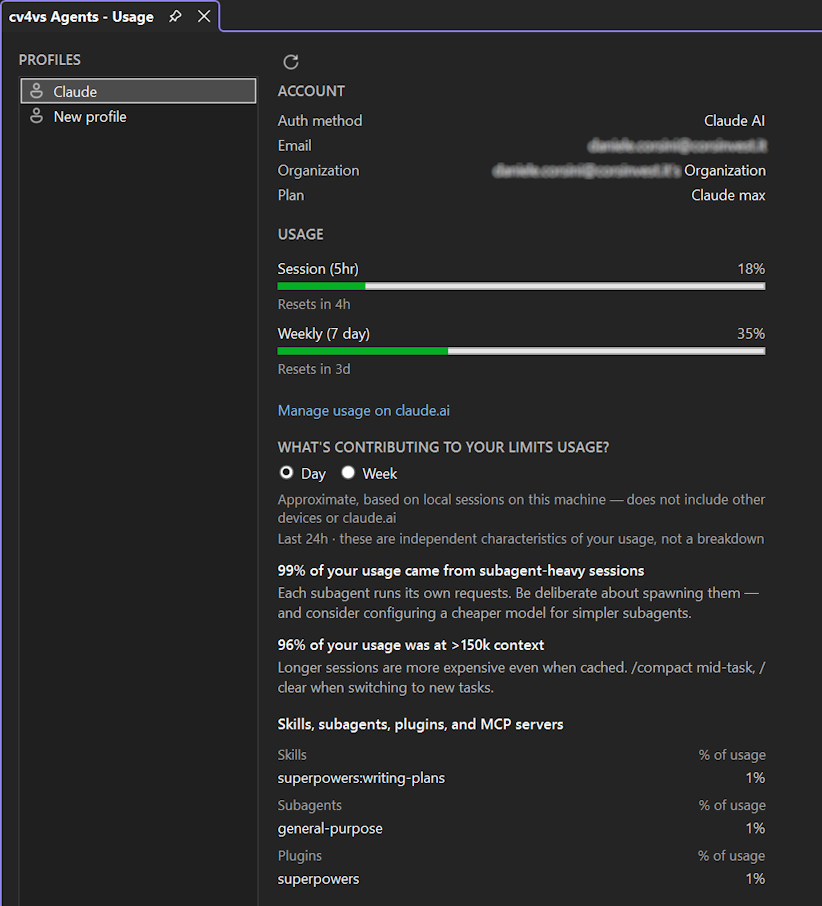

# Usage

A full-window view under **View → cv4vs Agents → Usage**: the live plan / rate-limit picture for
each profile, read from the CLI. It opens as a document-tab in the editor area, next to
[Statistics](statistics.md).

A profile list on the left; pick one and its **live** usage loads on the right — fetched from the CLI
for that profile (a short-lived process), so it reflects the real account, not something computed
here. **Refresh** re-fetches.

- **Account** — auth method, email, organization, plan.
- **Usage** — the plan's rate-limit windows (5-hour, 7-day, and per-model weeklies where they apply)
  as bars with utilisation and when each resets.
- **What's contributing to your limits usage?** — a Day / Week toggle over the CLI's own behaviour
  insights (e.g. how much came from subagent-heavy sessions or long context) and a per-category
  breakdown (skills, subagents, plugins, MCP servers).

The "Manage usage on claude.ai" link is shown only for the first-party Claude AI account; third-party
providers (z.ai/GLM, Bedrock, Vertex, gateway) don't get it — the link wouldn't apply.

## Status bar

The same numbers without opening anything: an item at the right of Visual Studio's status bar, beside
the notification bell.

`Claude: 5h 44% · 7d 10%` — the profile, then the session (5-hour) and weekly (7-day) windows, each with
a thin bar under it. A bar turns amber at 75% and red at 90%, or sooner when the CLI itself flags the
window. The tooltip lists every window with its reset time.

Click it for a popup with every window — per-model weeklies included — and when each resets, the
account (collapsed, so an email isn't on screen every time it opens), when the numbers were fetched,
and links to **Refresh**, this **Usage** tab and **claude.ai**. Esc or a click elsewhere closes it.

**Whose usage.** The profile of the Chat or CLI pane you last worked in, or the native **Claude** profile
until you have used one. A third-party profile (z.ai/GLM, Bedrock, Vertex, an API key) has no plan
limits, so the item shows just its name.

**Where the numbers come from, and what that costs.** The CLI is the only source — nothing is read from
your credentials, nothing is estimated here:

- A **chat pane** on that profile answers from its own running `claude.exe`, after each turn (at most
  once a minute) and whenever a rate-limit event arrives. No extra process.
- With **no such pane** open, a short-lived `claude.exe` — started without your MCP servers — refreshes
  the numbers only when they are older than *Status bar usage refresh (minutes)* (15 by default) while
  Visual Studio is in front, when the popup opens on numbers more than two minutes old, or on
  **Refresh**. Set the option to `0` and none is ever started in the background.

*Show plan usage in the status bar* turns the item off — see [Options](options.md#general).
